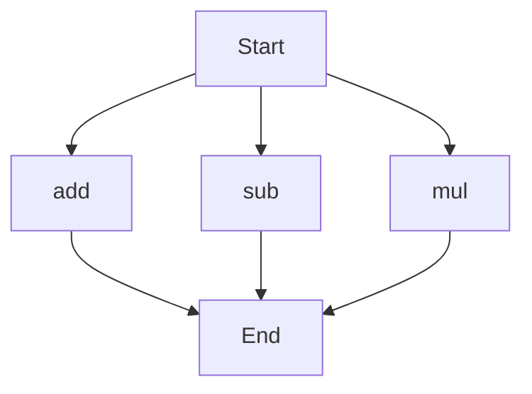

# API Documentation

## calculator.py
### Overview
The calculator.py file contains a collection of mathematical functions that can be used to perform basic arithmetic operations.

### Functions

#### add(a, b)
##### Description
The `add` function takes two numbers as input and returns their sum.
##### Parameters
* `a` (int or float): The first number to be added.
* `b` (int or float): The second number to be added.
##### Returns
* `int` or `float`: The sum of `a` and `b`.
##### Example
```python
result = add(5, 7)
print(result)  # Output: 12
```

#### sub(c, d)
##### Description
The `sub` function takes two numbers as input and returns their difference.
##### Parameters
* `c` (int or float): The first number.
* `d` (int or float): The second number to be subtracted from the first.
##### Returns
* `int` or `float`: The difference between `c` and `d`.
##### Example
```python
result = sub(10, 4)
print(result)  # Output: 6
```

#### mul(a, b)
##### Description
The `mul` function takes two numbers as input and returns their product.
##### Parameters
* `a` (int or float): The first number to be multiplied.
* `b` (int or float): The second number to be multiplied.
##### Returns
* `int` or `float`: The product of `a` and `b`.
##### Example
```python
result = mul(6, 9)
print(result)  # Output: 54
```

### Execution Flow
Since there are multiple functions in this file, here is a flowchart showing the execution flow:


### Module-Level Code
When run directly, this script does not execute any specific module-level code, as it only contains function definitions. However, you can use the functions provided to perform arithmetic operations. 

Note: There are no classes or variables in this file.