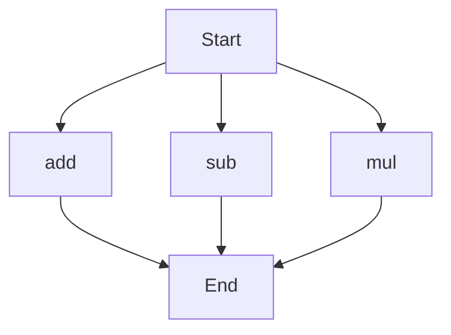

# API Documentation
## calculator.py
The calculator.py file contains a set of functions for basic arithmetic operations. 

### add(a, b)
#### Description
The `add` function calculates the sum of two numbers, `a` and `b`.

#### Parameters
* `a` (int or float): The first number to add.
* `b` (int or float): The second number to add.

#### Returns
* `int` or `float`: The sum of `a` and `b`.

#### Example
```python
result = add(5, 7)
print(result)  # Output: 12
```

### sub(c, d)
#### Description
The `sub` function calculates the difference between two numbers, `c` and `d`.

#### Parameters
* `c` (int or float): The first number.
* `d` (int or float): The second number to subtract from the first.

#### Returns
* `int` or `float`: The result of subtracting `d` from `c`.

#### Example
```python
result = sub(10, 4)
print(result)  # Output: 6
```

### mul(a, b)
#### Description
The `mul` function calculates the product of two numbers, `a` and `b`.

#### Parameters
* `a` (int or float): The first number to multiply.
* `b` (int or float): The second number to multiply.

#### Returns
* `int` or `float`: The product of `a` and `b`.

#### Example
```python
result = mul(5, 6)
print(result)  # Output: 30
```

Since the calculator.py file has more than one function, the following flowchart illustrates the potential execution flow of these functions:

This flowchart shows that the script can start with any of the three functions (`add`, `sub`, `mul`) and proceed to the end of the execution. 

When run directly, this script does not contain a main block or any print statements that execute module-level code. It is designed to be imported and used in other scripts.