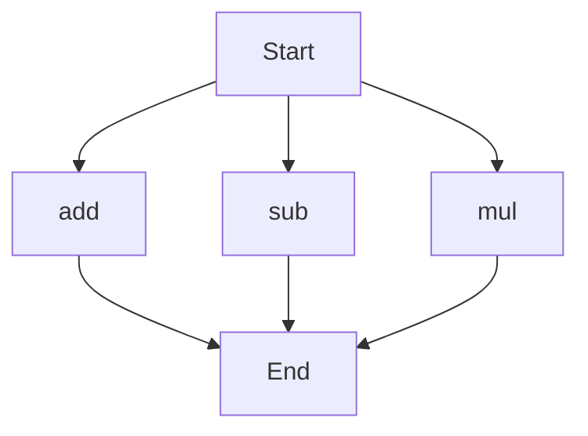

# API Documentation
## calculator.py
The calculator.py file contains a collection of mathematical functions.

### add(a, b)
#### Description
The `add` function calculates the sum of two numbers.

#### Parameters
* `a` (int or float): The first number to add.
* `b` (int or float): The second number to add.

#### Returns
* `int` or `float`: The sum of `a` and `b`.

#### Example
```python
result = add(5, 3)
print(result)  # Output: 8
```

### sub(c, d)
#### Description
The `sub` function calculates the difference between two numbers.

#### Parameters
* `c` (int or float): The first number.
* `d` (int or float): The second number to subtract.

#### Returns
* `int` or `float`: The difference between `c` and `d`.

#### Example
```python
result = sub(10, 4)
print(result)  # Output: 6
```

### mul(a, b)
#### Description
The `mul` function calculates the product of two numbers.

#### Parameters
* `a` (int or float): The first number to multiply.
* `b` (int or float): The second number to multiply.

#### Returns
* `int` or `float`: The product of `a` and `b`.

#### Example
```python
result = mul(5, 6)
print(result)  # Output: 30
```

Since there are multiple functions in this file, the execution flow can be represented as follows:

Note: The flowchart illustrates that the script can start with any of the `add`, `sub`, or `mul` functions and will end after executing the chosen function. 

When run directly, this script does not have a main block, so it does not perform any actions by default. The functions can be used as building blocks for other scripts or programs.