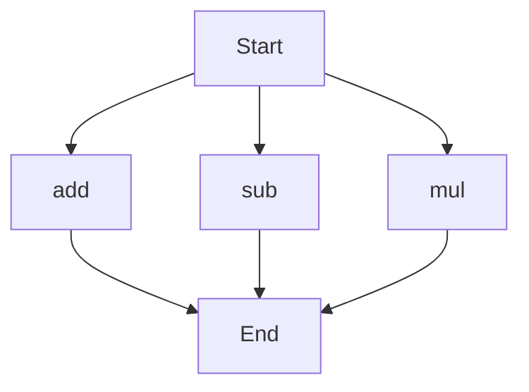

# API Documentation
## calculator.py
### Functions
#### add(a, b)
##### Description
The `add` function calculates the sum of two numbers.
##### Parameters
* `a` (int or float): The first number to add.
* `b` (int or float): The second number to add.
##### Returns
The sum of `a` and `b`.
##### Example
```python
result = add(5, 3)
print(result)  # Outputs: 8
```

#### sub(c, d)
##### Description
The `sub` function calculates the difference of two numbers.
##### Parameters
* `c` (int or float): The first number.
* `d` (int or float): The second number to subtract.
##### Returns
The difference of `c` and `d`.
##### Example
```python
result = sub(10, 4)
print(result)  # Outputs: 6
```

#### mul(a, b)
##### Description
The `mul` function calculates the product of two numbers.
##### Parameters
* `a` (int or float): The first number to multiply.
* `b` (int or float): The second number to multiply.
##### Returns
The product of `a` and `b`.
##### Example
```python
result = mul(5, 6)
print(result)  # Outputs: 30
```

### Execution Flow
Since there are multiple functions in this file, here is a high-level overview of the execution flow:

Note: This flowchart assumes that the functions are called independently. The actual execution flow may vary depending on how the functions are used in the code.

### Module-Level Code
When run directly, this script does not have any module-level code that executes. It only defines the `add`, `sub`, and `mul` functions for use in other parts of the program.