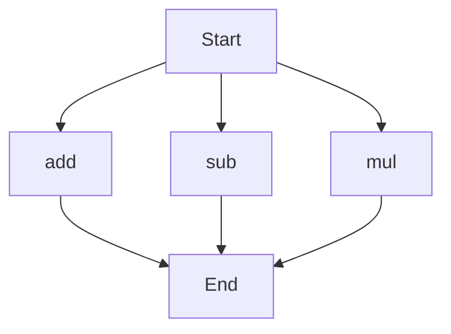

# API Documentation
## calculator.py
The calculator.py file contains a collection of mathematical functions that can be used to perform basic arithmetic operations.

### add(a, b)
#### Description
The `add` function takes two numbers as input and returns their sum.

#### Parameters
* `a` (int or float): The first number to add.
* `b` (int or float): The second number to add.

#### Returns
* `int` or `float`: The sum of `a` and `b`.

#### Example
```python
result = add(5, 3)
print(result)  # Output: 8
```

### sub(c, d)
#### Description
The `sub` function takes two numbers as input and returns their difference.

#### Parameters
* `c` (int or float): The first number.
* `d` (int or float): The second number to subtract from the first.

#### Returns
* `int` or `float`: The difference between `c` and `d`.

#### Example
```python
result = sub(10, 4)
print(result)  # Output: 6
```

### mul(a, b)
#### Description
The `mul` function takes two numbers as input and returns their product.

#### Parameters
* `a` (int or float): The first number to multiply.
* `b` (int or float): The second number to multiply.

#### Returns
* `int` or `float`: The product of `a` and `b`.

#### Example
```python
result = mul(5, 6)
print(result)  # Output: 30
```

Since this file contains more than one function, the execution flow can be represented as follows:

Note: The execution flow is not strictly sequential, as these functions can be called independently. This flowchart illustrates the possible paths of execution when using these functions. 

There are no classes or variables in this file, and no module-level code that runs when the script is executed directly.