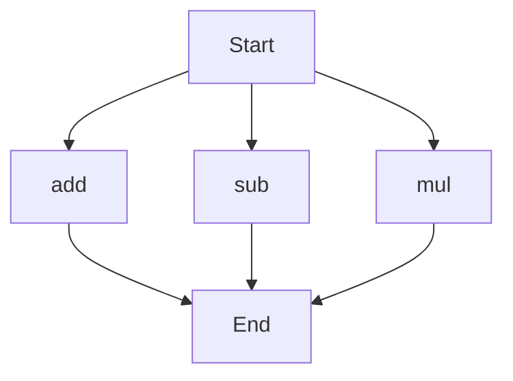

# API Documentation

## calculator.py
### Description
This module provides basic arithmetic operations.

### Functions
#### add(a, b)
##### Description
The `add` function calculates the sum of two numbers.
##### Parameters
* `a` (int or float): The first number to add.
* `b` (int or float): The second number to add.
##### Returns
* `int` or `float`: The sum of `a` and `b`.
##### Example
```python
result = add(5, 7)
print(result)  # Output: 12
```

#### sub(c, d)
##### Description
The `sub` function calculates the difference between two numbers.
##### Parameters
* `c` (int or float): The first number.
* `d` (int or float): The second number to subtract from the first.
##### Returns
* `int` or `float`: The difference between `c` and `d`.
##### Example
```python
result = sub(10, 4)
print(result)  # Output: 6
```

#### mul(a, b)
##### Description
The `mul` function calculates the product of two numbers.
##### Parameters
* `a` (int or float): The first number to multiply.
* `b` (int or float): The second number to multiply.
##### Returns
* `int` or `float`: The product of `a` and `b`.
##### Example
```python
result = mul(6, 9)
print(result)  # Output: 54
```

### Execution Flow
Since there are multiple functions in this module, the following flowchart represents the execution flow:

Note: The flowchart shows the possible execution paths for each function, but it does not imply a specific order of execution. The actual execution flow will depend on how the functions are called in the code. 

### Module-Level Code
When run directly, this script does not execute any code, as it only defines functions. To use the functions, you need to import this module in another script and call the functions as needed. 

Since the original code does not contain any classes or variables, there is no additional documentation to provide for those elements.