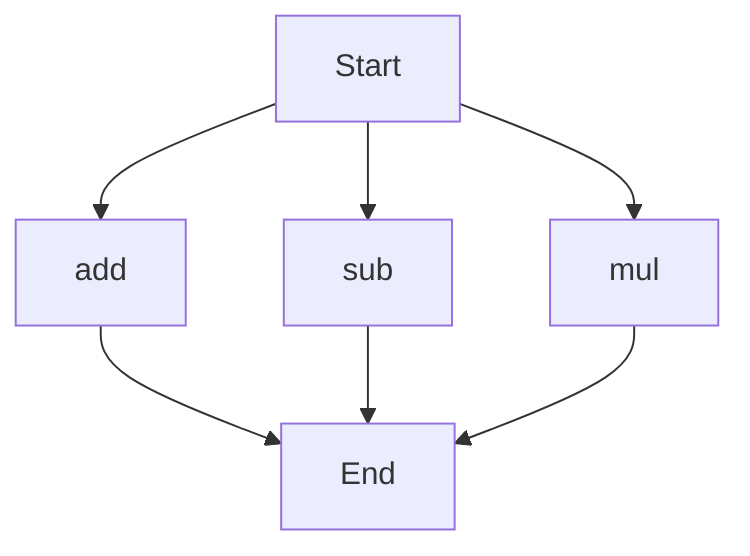

# API Documentation

## calculator.py
The `calculator.py` file contains a set of mathematical functions that can be used to perform basic arithmetic operations.

### Functions
#### add(a, b)
##### Description
The `add` function calculates the sum of two numbers.

##### Parameters
* `a` (int or float): The first number to add.
* `b` (int or float): The second number to add.

##### Returns
* `int` or `float`: The sum of `a` and `b`.

##### Example
```python
result = add(5, 3)
print(result)  # Outputs: 8
```

#### sub(c, d)
##### Description
The `sub` function calculates the difference between two numbers.

##### Parameters
* `c` (int or float): The first number.
* `d` (int or float): The second number to subtract.

##### Returns
* `int` or `float`: The difference between `c` and `d`.

##### Example
```python
result = sub(10, 4)
print(result)  # Outputs: 6
```

#### mul(a, b)
##### Description
The `mul` function calculates the product of two numbers.

##### Parameters
* `a` (int or float): The first number to multiply.
* `b` (int or float): The second number to multiply.

##### Returns
* `int` or `float`: The product of `a` and `b`.

##### Example
```python
result = mul(5, 6)
print(result)  # Outputs: 30
```

### Execution Flow
Since there are multiple functions in this file, the execution flow can be represented as follows:

This flowchart shows that the execution can start with any of the three functions, and each function will execute independently.

Note: There are no classes or variables defined in this file, so there is no need to document them. The script does not contain any module-level code, so there is no need to describe its behavior when run directly.