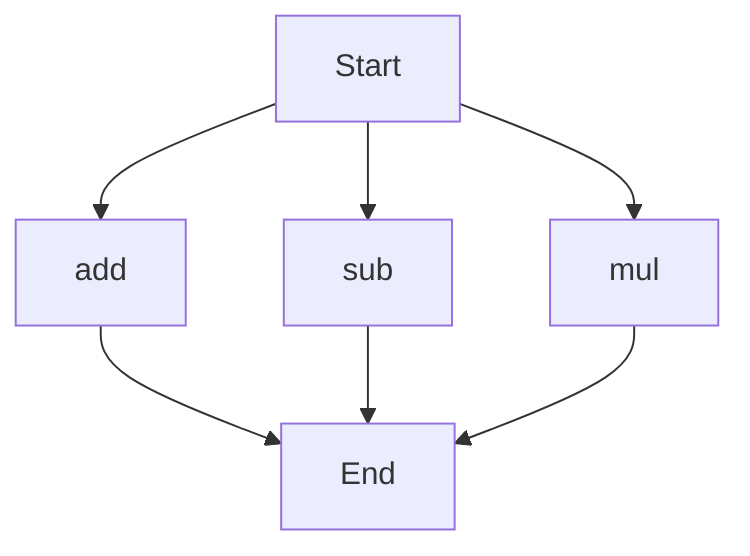

# API Documentation
## calculator.py
The calculator.py file contains a set of functions for basic arithmetic operations.

### Functions
#### add(a, b)
##### Description
The `add` function calculates the sum of two numbers.
##### Parameters
* `a` (int or float): The first number to add.
* `b` (int or float): The second number to add.
##### Returns
The sum of `a` and `b`.
##### Example
```python
result = add(5, 7)
print(result)  # Output: 12
```

#### sub(c, d)
##### Description
The `sub` function calculates the difference of two numbers.
##### Parameters
* `c` (int or float): The first number.
* `d` (int or float): The second number to subtract.
##### Returns
The difference of `c` and `d`.
##### Example
```python
result = sub(10, 4)
print(result)  # Output: 6
```

#### mul(a, b)
##### Description
The `mul` function calculates the product of two numbers.
##### Parameters
* `a` (int or float): The first number to multiply.
* `b` (int or float): The second number to multiply.
##### Returns
The product of `a` and `b`.
##### Example
```python
result = mul(5, 6)
print(result)  # Output: 30
```

### Execution Flow
Since there are multiple functions in this file, the execution flow can be represented as follows:

This flowchart shows that the program can start with any of the three functions (`add`, `sub`, or `mul`) and will end after the execution of the chosen function.

Note: There are no classes or variables defined in this file, so no additional documentation is provided for those.