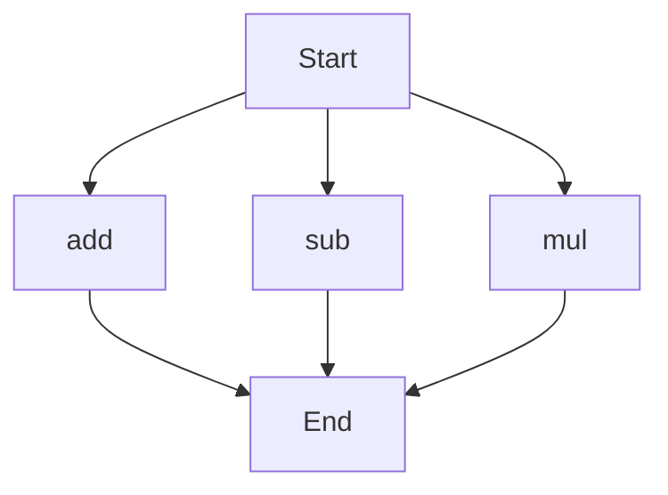

# API Documentation

## calculator.py
The `calculator.py` file contains a collection of mathematical functions.

### add(a, b)
#### Description
The `add` function calculates the sum of two given numbers.

#### Parameters
* `a` (int or float): The first number to be added.
* `b` (int or float): The second number to be added.

#### Returns
The sum of `a` and `b`.

#### Example
```python
result = add(5, 7)
print(result)  # Outputs: 12
```

### sub(c, d)
#### Description
The `sub` function calculates the difference between two given numbers.

#### Parameters
* `c` (int or float): The first number.
* `d` (int or float): The second number to be subtracted from the first.

#### Returns
The difference between `c` and `d`.

#### Example
```python
result = sub(10, 4)
print(result)  # Outputs: 6
```

### mul(a, b)
#### Description
The `mul` function calculates the product of two given numbers.

#### Parameters
* `a` (int or float): The first number to be multiplied.
* `b` (int or float): The second number to be multiplied.

#### Returns
The product of `a` and `b`.

#### Example
```python
result = mul(6, 9)
print(result)  # Outputs: 54
```

Since the `calculator.py` file contains more than one function, the execution flow can be represented as follows:

Note: The flowchart shows the possible execution paths for each function in the `calculator.py` file. The actual execution flow depends on how the functions are called in the script or by other parts of the program.