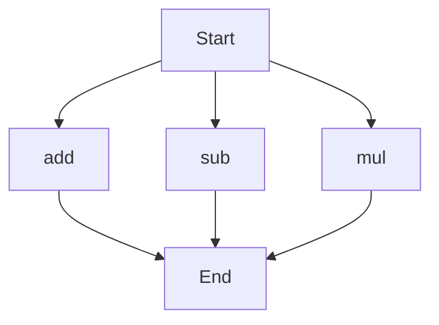

# API Documentation

## calculator.py
The `calculator.py` file contains a set of basic arithmetic functions. 

### add(a, b)
#### Description
The `add(a, b)` function calculates the sum of two numbers.
#### Parameters
* `a` (int or float): The first number to add.
* `b` (int or float): The second number to add.
#### Returns
The sum of `a` and `b`.
#### Example
```python
result = add(5, 7)
print(result)  # Output: 12
```

### sub(c, d)
#### Description
The `sub(c, d)` function calculates the difference between two numbers.
#### Parameters
* `c` (int or float): The first number.
* `d` (int or float): The second number to subtract.
#### Returns
The difference between `c` and `d`.
#### Example
```python
result = sub(10, 4)
print(result)  # Output: 6
```

### mul(a, b)
#### Description
The `mul(a, b)` function calculates the product of two numbers.
#### Parameters
* `a` (int or float): The first number to multiply.
* `b` (int or float): The second number to multiply.
#### Returns
The product of `a` and `b`.
#### Example
```python
result = mul(6, 8)
print(result)  # Output: 48
```

Since there are multiple functions in this file, we can represent the execution flow using the following flowchart:

When run directly, this script does not have any module-level code, so there is no specific behavior to describe.