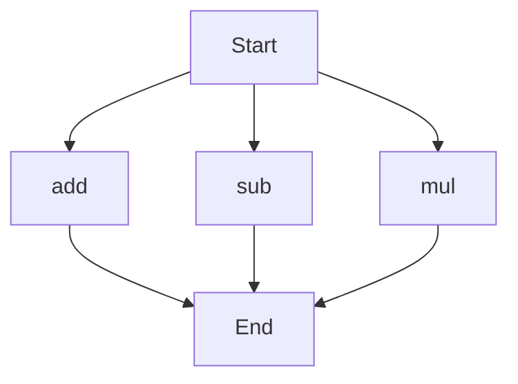

# API Documentation
## calculator.py
The calculator.py file contains a collection of mathematical functions for performing arithmetic operations.

### add(a, b)
#### Description
The `add(a, b)` function calculates the sum of two numbers.
#### Parameters
* `a` (int or float): The first number to be added.
* `b` (int or float): The second number to be added.
#### Returns
The sum of `a` and `b`.
#### Example
```python
result = add(5, 7)
print(result)  # Outputs: 12
```

### sub(c, d)
#### Description
The `sub(c, d)` function calculates the difference between two numbers.
#### Parameters
* `c` (int or float): The first number.
* `d` (int or float): The second number to be subtracted from the first.
#### Returns
The difference between `c` and `d`.
#### Example
```python
result = sub(10, 4)
print(result)  # Outputs: 6
```

### mul(a, b)
#### Description
The `mul(a, b)` function calculates the product of two numbers.
#### Parameters
* `a` (int or float): The first number to be multiplied.
* `b` (int or float): The second number to be multiplied.
#### Returns
The product of `a` and `b`.
#### Example
```python
result = mul(5, 6)
print(result)  # Outputs: 30
```

Since the calculator.py file contains more than one function, the following flowchart illustrates the execution flow:

Note that this flowchart indicates that the execution can start with any of the three functions (`add`, `sub`, or `mul`) and will end after the chosen function is executed. 

This script does not contain any module-level code, classes, or variables.