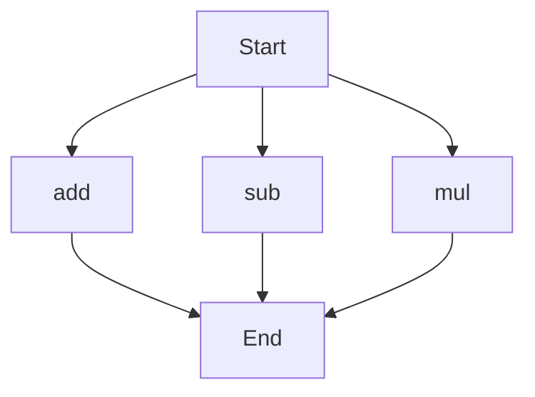

# API Documentation
## calculator.py
The calculator.py file contains a set of mathematical functions that can be used to perform basic arithmetic operations.

### Functions
#### add(a, b)
##### Description
The `add` function calculates the sum of two numbers.
##### Parameters
* `a` (int or float): The first number to be added.
* `b` (int or float): The second number to be added.
##### Returns
* The sum of `a` and `b`.
##### Example
```python
result = add(5, 7)
print(result)  # Outputs: 12
```

#### sub(c, d)
##### Description
The `sub` function calculates the difference between two numbers.
##### Parameters
* `c` (int or float): The first number.
* `d` (int or float): The second number to be subtracted from the first.
##### Returns
* The difference between `c` and `d`.
##### Example
```python
result = sub(10, 4)
print(result)  # Outputs: 6
```

#### mul(a, b)
##### Description
The `mul` function calculates the product of two numbers.
##### Parameters
* `a` (int or float): The first number to be multiplied.
* `b` (int or float): The second number to be multiplied.
##### Returns
* The product of `a` and `b`.
##### Example
```python
result = mul(6, 9)
print(result)  # Outputs: 54
```

### Execution Flow
Since there are multiple functions in this file, the following flowchart illustrates the possible execution paths:

Note that the actual execution flow will depend on how the functions are called in the code. This flowchart simply shows the possible paths. 

Please note that when running this script directly, the functions are defined but no specific calculations are performed. To use these functions, you would need to call them with the desired input values.