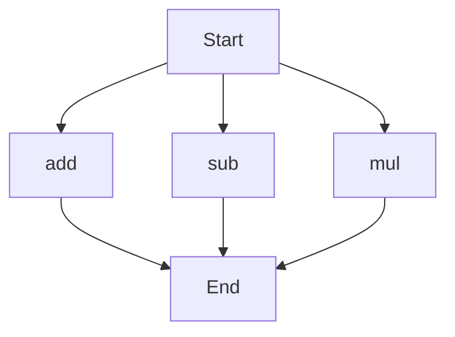

# API Documentation

## calculator.py
The `calculator.py` file contains a collection of basic arithmetic functions.

### Functions
#### add(a, b)
##### Description
The `add` function calculates the sum of two numbers.
##### Parameters
* `a` (int or float): The first number to add.
* `b` (int or float): The second number to add.
##### Returns
The sum of `a` and `b`.
##### Example
```python
result = add(5, 3)
print(result)  # Output: 8
```

#### sub(c, d)
##### Description
The `sub` function calculates the difference of two numbers.
##### Parameters
* `c` (int or float): The first number.
* `d` (int or float): The second number to subtract from the first.
##### Returns
The difference of `c` and `d`.
##### Example
```python
result = sub(10, 4)
print(result)  # Output: 6
```

#### mul(a, b)
##### Description
The `mul` function calculates the product of two numbers.
##### Parameters
* `a` (int or float): The first number to multiply.
* `b` (int or float): The second number to multiply.
##### Returns
The product of `a` and `b`.
##### Example
```python
result = mul(4, 5)
print(result)  # Output: 20
```

### Execution Flow
Since there are multiple functions in this file, the execution flow can be represented as follows:


Note: This flowchart represents the possible execution paths, but the actual flow may vary depending on how the functions are called and used in the program. 

There are no classes or variables in this file, so no additional documentation is provided for those. 

When run directly, this script does not execute any code, as it only defines functions. To use these functions, you would need to import this module into another Python script and call the functions from there.