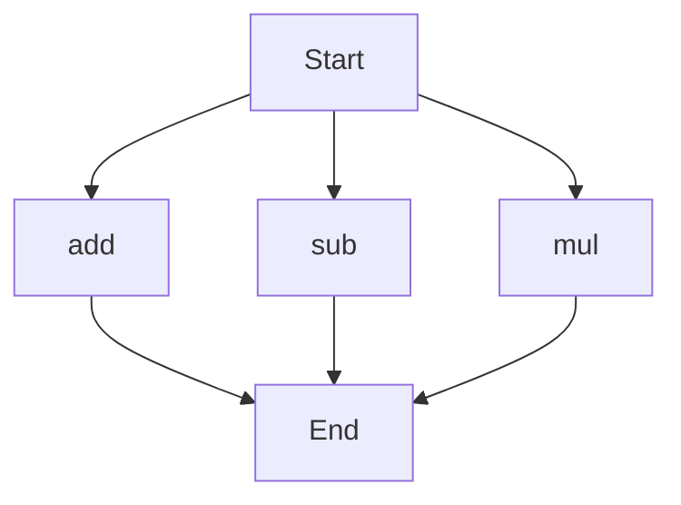

# API Documentation
## calculator.py
The calculator.py file contains a set of functions for performing basic arithmetic operations.

### add(a, b)
#### Description
The `add` function calculates the sum of two numbers.

#### Parameters
* `a` (int or float): The first number to be added.
* `b` (int or float): The second number to be added.

#### Returns
The sum of `a` and `b` as an integer or floating point number.

#### Example
```python
result = add(5, 3)
print(result)  # Output: 8
```

### sub(c, d)
#### Description
The `sub` function calculates the difference between two numbers.

#### Parameters
* `c` (int or float): The first number.
* `d` (int or float): The second number to be subtracted from the first.

#### Returns
The difference between `c` and `d` as an integer or floating point number.

#### Example
```python
result = sub(10, 4)
print(result)  # Output: 6
```

### mul(a, b)
#### Description
The `mul` function calculates the product of two numbers.

#### Parameters
* `a` (int or float): The first number to be multiplied.
* `b` (int or float): The second number to be multiplied.

#### Returns
The product of `a` and `b` as an integer or floating point number.

#### Example
```python
result = mul(5, 6)
print(result)  # Output: 30
```

Since the calculator.py file contains more than one function, the following flowchart illustrates the execution flow of these functions:

Note that this flowchart represents a simplified view of the functions' execution flow. In a real-world scenario, the actual flow may depend on the specific use case and the order in which the functions are called. 

When run directly, the calculator.py script does not contain any module-level code, such as print statements or main blocks, that would execute when the script is run as the main program. It is intended to be used as a module, importing its functions into other scripts for use.