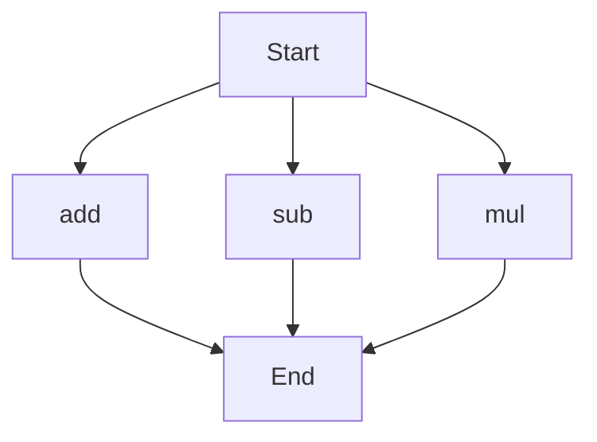

# API Documentation
## calculator.py
The calculator.py file contains a set of mathematical functions that can be used to perform basic arithmetic operations.

### add(a, b)
#### Description
The `add` function takes two parameters and returns their sum.
#### Parameters
* `a` (int or float): The first number to be added.
* `b` (int or float): The second number to be added.
#### Returns
* `int` or `float`: The sum of `a` and `b`.
#### Example
```python
result = add(5, 7)
print(result)  # Outputs: 12
```

### sub(c, d)
#### Description
The `sub` function takes two parameters and returns their difference.
#### Parameters
* `c` (int or float): The first number.
* `d` (int or float): The second number to be subtracted from the first.
#### Returns
* `int` or `float`: The difference between `c` and `d`.
#### Example
```python
result = sub(10, 4)
print(result)  # Outputs: 6
```

### mul(a, b)
#### Description
The `mul` function takes two parameters and returns their product.
#### Parameters
* `a` (int or float): The first number to be multiplied.
* `b` (int or float): The second number to be multiplied.
#### Returns
* `int` or `float`: The product of `a` and `b`.
#### Example
```python
result = mul(5, 6)
print(result)  # Outputs: 30
```

Since the calculator.py file contains more than one function, the following flowchart illustrates the execution flow:

Note: This flowchart assumes that the functions can be called independently, and the execution flow may vary depending on the actual usage of these functions in a larger program. 

There are no classes or variables defined in this file. When run directly, this script does not have a main block, so it does not perform any operations by itself. It is intended to be imported as a module in other Python scripts.