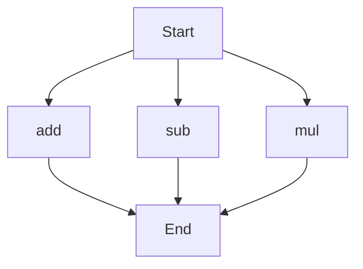

# API Documentation

## calculator.py
The calculator.py file contains a set of mathematical functions that can be used to perform basic arithmetic operations.

### Functions
#### add(a, b)
##### Description
The `add` function takes two numbers as input and returns their sum.

##### Parameters
* `a` (int or float): The first number to be added.
* `b` (int or float): The second number to be added.

##### Returns
* `int` or `float`: The sum of `a` and `b`.

##### Example
```python
result = add(5, 3)
print(result)  # Output: 8
```

#### sub(c, d)
##### Description
The `sub` function takes two numbers as input and returns their difference.

##### Parameters
* `c` (int or float): The first number.
* `d` (int or float): The second number to be subtracted from the first.

##### Returns
* `int` or `float`: The difference between `c` and `d`.

##### Example
```python
result = sub(10, 4)
print(result)  # Output: 6
```

#### mul(a, b)
##### Description
The `mul` function takes two numbers as input and returns their product.

##### Parameters
* `a` (int or float): The first number to be multiplied.
* `b` (int or float): The second number to be multiplied.

##### Returns
* `int` or `float`: The product of `a` and `b`.

##### Example
```python
result = mul(7, 2)
print(result)  # Output: 14
```

### Execution Flow
Since there are multiple functions in this file, the execution flow can be represented as follows:

This flowchart shows that the script can start with any of the three functions (`add`, `sub`, or `mul`) and will terminate after executing the chosen function.

### Module-Level Code
When run directly, this script does not have any module-level code that will be executed. It is intended to be imported and used as a module in other Python scripts.