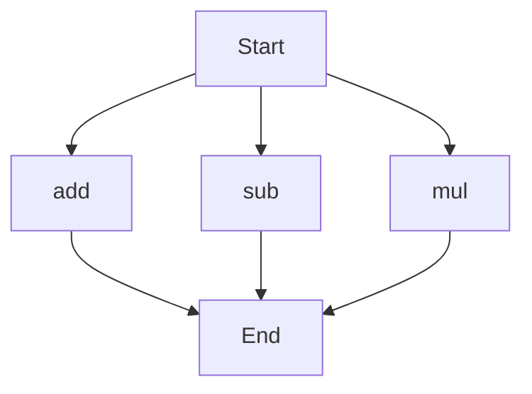

# API Documentation

## calculator.py
### Description
This Python module provides basic arithmetic operations.

### Functions
#### add(a, b)
##### Description
This function calculates the sum of two numbers.
##### Parameters
* `a` (int or float): The first number to add.
* `b` (int or float): The second number to add.
##### Returns
* `int` or `float`: The sum of `a` and `b`.
##### Example
```python
result = add(5, 7)
print(result)  # Output: 12
```

#### sub(c, d)
##### Description
This function calculates the difference between two numbers.
##### Parameters
* `c` (int or float): The first number.
* `d` (int or float): The second number to subtract.
##### Returns
* `int` or `float`: The difference between `c` and `d`.
##### Example
```python
result = sub(10, 4)
print(result)  # Output: 6
```

#### mul(a, b)
##### Description
This function calculates the product of two numbers.
##### Parameters
* `a` (int or float): The first number to multiply.
* `b` (int or float): The second number to multiply.
##### Returns
* `int` or `float`: The product of `a` and `b`.
##### Example
```python
result = mul(3, 9)
print(result)  # Output: 27
```

### Execution Flow
Since this module has multiple functions, the execution flow is as follows:

Note: The execution flow assumes that the functions are called independently, and there is no specific order of execution.

### Module-Level Code
When run directly, this script does not execute any specific code, as it only contains function definitions. To use the functions, import the module and call the desired function.