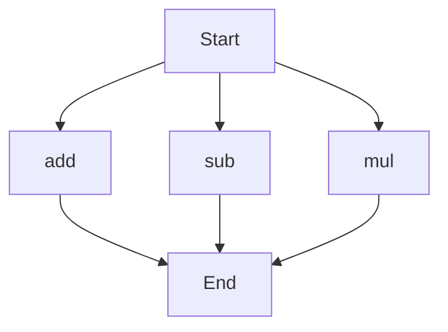

# API Documentation

## calculator.py
The calculator.py file contains a set of functions for performing basic arithmetic operations.

### add(a, b)
#### Description
The `add` function calculates the sum of two numbers.

#### Parameters
* `a` (int or float): The first number to add.
* `b` (int or float): The second number to add.

#### Returns
* `int` or `float`: The sum of `a` and `b`.

#### Example
```python
result = add(5, 3)
print(result)  # Output: 8
```

### sub(c, d)
#### Description
The `sub` function calculates the difference between two numbers.

#### Parameters
* `c` (int or float): The first number.
* `d` (int or float): The second number to subtract.

#### Returns
* `int` or `float`: The difference between `c` and `d`.

#### Example
```python
result = sub(10, 4)
print(result)  # Output: 6
```

### mul(a, b)
#### Description
The `mul` function calculates the product of two numbers.

#### Parameters
* `a` (int or float): The first number to multiply.
* `b` (int or float): The second number to multiply.

#### Returns
* `int` or `float`: The product of `a` and `b`.

#### Example
```python
result = mul(7, 2)
print(result)  # Output: 14
```

Since there are multiple functions in this file, the following flowchart illustrates the execution flow:

Note: This flowchart assumes that each function can be called independently, and the `Start` node represents the entry point of the script. The `End` node represents the termination of the script. 

There is no module-level code, classes, or variables in this file. Therefore, no additional documentation is provided.