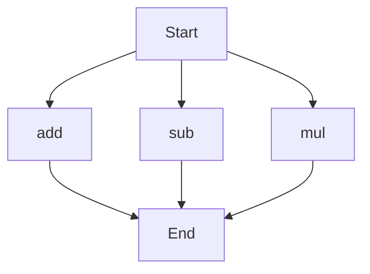

# API Documentation

## calculator.py
This file contains a collection of mathematical functions to perform basic arithmetic operations.

### add(a, b)
#### Description
The `add` function takes two numbers as input and returns their sum.

#### Parameters
* `a` (int or float): The first number to add.
* `b` (int or float): The second number to add.

#### Returns
* `int` or `float`: The sum of `a` and `b`.

#### Example
```python
result = add(5, 7)
print(result)  # Outputs: 12
```

### sub(c, d)
#### Description
The `sub` function takes two numbers as input and returns their difference.

#### Parameters
* `c` (int or float): The first number.
* `d` (int or float): The second number to subtract from the first.

#### Returns
* `int` or `float`: The difference between `c` and `d`.

#### Example
```python
result = sub(10, 4)
print(result)  # Outputs: 6
```

### mul(a, b)
#### Description
The `mul` function takes two numbers as input and returns their product.

#### Parameters
* `a` (int or float): The first number to multiply.
* `b` (int or float): The second number to multiply.

#### Returns
* `int` or `float`: The product of `a` and `b`.

#### Example
```python
result = mul(5, 7)
print(result)  # Outputs: 35
```

Since this file contains more than one function, the following flowchart illustrates the execution flow:

Note: The flowchart assumes that the functions can be called independently, and the `Start` node represents the beginning of the program. The `End` node represents the completion of the function calls. 

There are no classes or variables defined in this file, and there is no module-level code beyond the function definitions.