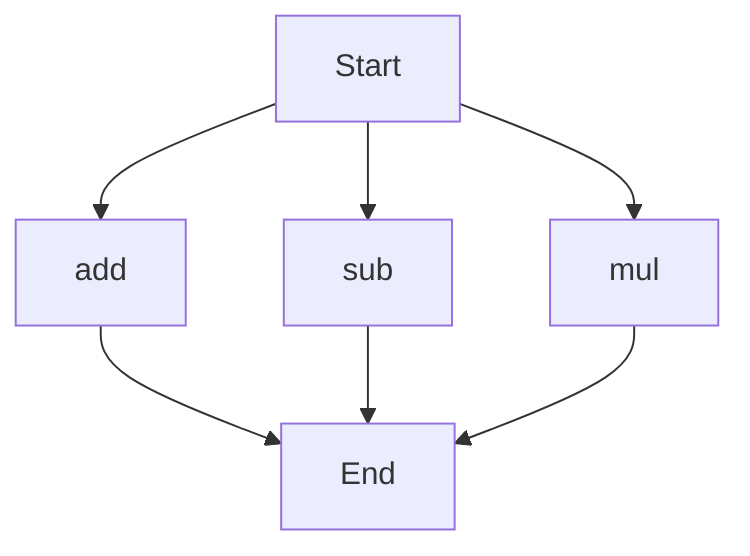

# API Documentation
## calculator.py
### Functions
#### add(a, b)
##### Description
The `add` function calculates the sum of two numbers.
##### Parameters
* `a` (int or float): The first number to add.
* `b` (int or float): The second number to add.
##### Returns
The sum of `a` and `b`.
##### Example
```python
result = add(5, 3)
print(result)  # Output: 8
```

#### sub(c, d)
##### Description
The `sub` function calculates the difference of two numbers.
##### Parameters
* `c` (int or float): The first number.
* `d` (int or float): The second number to subtract.
##### Returns
The difference of `c` and `d`.
##### Example
```python
result = sub(10, 4)
print(result)  # Output: 6
```

#### mul(a, b)
##### Description
The `mul` function calculates the product of two numbers.
##### Parameters
* `a` (int or float): The first number to multiply.
* `b` (int or float): The second number to multiply.
##### Returns
The product of `a` and `b`.
##### Example
```python
result = mul(5, 6)
print(result)  # Output: 30
```

### Execution Flow
Since there are multiple functions in this file, the execution flow can be represented as follows:

Note: The execution flow is not necessarily linear, as the functions can be called independently.

### Module-Level Code
When run directly, this script does not contain any module-level code, such as print statements or a main block. It is designed to be imported and used as a module by other scripts.