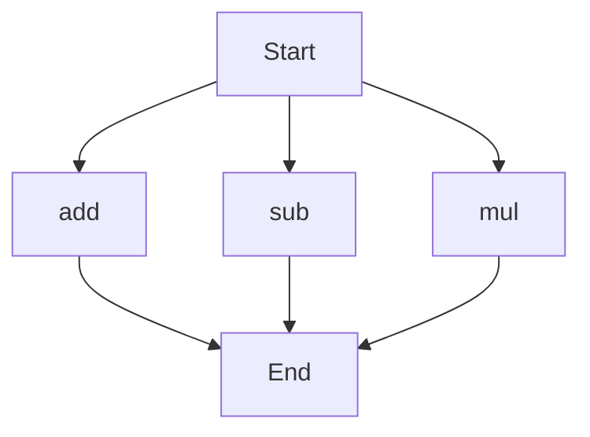

# API Documentation
## calculator.py
This module provides basic arithmetic operations.

### Functions
#### add(a, b)
##### Description
The `add` function calculates the sum of two numbers.
##### Parameters
* `a` (int or float): The first number to add.
* `b` (int or float): The second number to add.
##### Returns
The sum of `a` and `b`.
##### Example
```python
result = add(5, 3)
print(result)  # Outputs: 8
```

#### sub(c, d)
##### Description
The `sub` function calculates the difference of two numbers.
##### Parameters
* `c` (int or float): The first number.
* `d` (int or float): The second number to subtract from the first.
##### Returns
The difference of `c` and `d`.
##### Example
```python
result = sub(10, 4)
print(result)  # Outputs: 6
```

#### mul(a, b)
##### Description
The `mul` function calculates the product of two numbers.
##### Parameters
* `a` (int or float): The first number to multiply.
* `b` (int or float): The second number to multiply.
##### Returns
The product of `a` and `b`.
##### Example
```python
result = mul(7, 2)
print(result)  # Outputs: 14
```

### Execution Flow
Since this module has more than one function, the following flowchart illustrates the execution flow:

Note that the execution flow is not a linear sequence, as the functions can be called independently.

### Module-Level Code
When run directly, this script does not execute any code, as it only defines functions. To use the functions, import the module in another script and call the desired functions.