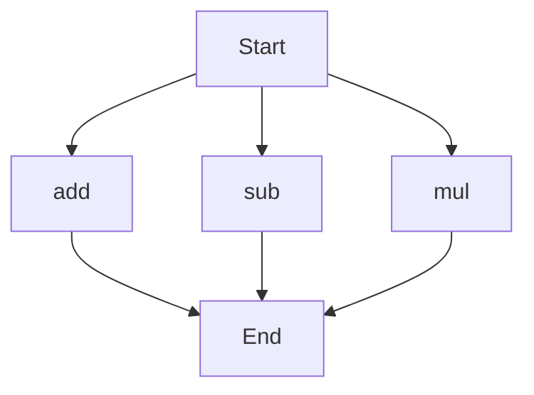

# API Documentation
## calculator.py
The calculator.py file contains a set of mathematical functions that can be used to perform basic arithmetic operations.

### add(a, b)
#### Description
The `add` function calculates the sum of two numbers.

#### Parameters
* `a` (number): The first number to add.
* `b` (number): The second number to add.

#### Returns
The sum of `a` and `b`.

#### Example
```python
result = add(5, 3)
print(result)  # Output: 8
```

### sub(c, d)
#### Description
The `sub` function calculates the difference of two numbers.

#### Parameters
* `c` (number): The first number.
* `d` (number): The second number to subtract from the first.

#### Returns
The difference of `c` and `d`.

#### Example
```python
result = sub(10, 4)
print(result)  # Output: 6
```

### mul(a, b)
#### Description
The `mul` function calculates the product of two numbers.

#### Parameters
* `a` (number): The first number to multiply.
* `b` (number): The second number to multiply.

#### Returns
The product of `a` and `b`.

#### Example
```python
result = mul(5, 6)
print(result)  # Output: 30
```

Since there are multiple functions in this file, the execution flow can be represented as follows:

This flowchart shows that the execution flow starts at the beginning of the script and can proceed to any of the three functions (`add`, `sub`, or `mul`) before ending. 

Note: This script does not contain any module-level code or variables.