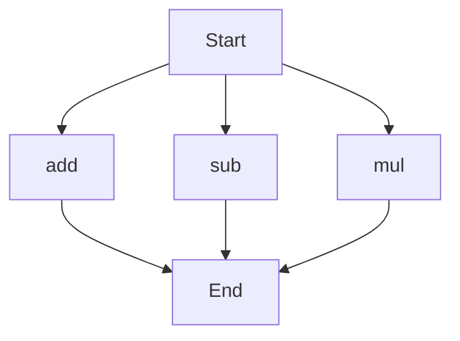

# API Documentation

## calculator.py
The calculator.py module provides a set of basic arithmetic functions for addition, subtraction, and multiplication.

### Functions
#### add(a, b)
##### Description
The add function calculates the sum of two numbers.

##### Parameters
* `a` (int or float): The first number to add.
* `b` (int or float): The second number to add.

##### Returns
* `int` or `float`: The sum of `a` and `b`.

##### Example
```python
result = add(5, 3)
print(result)  # Output: 8
```

#### sub(c, d)
##### Description
The sub function calculates the difference between two numbers.

##### Parameters
* `c` (int or float): The first number.
* `d` (int or float): The second number to subtract.

##### Returns
* `int` or `float`: The difference between `c` and `d`.

##### Example
```python
result = sub(10, 4)
print(result)  # Output: 6
```

#### mul(a, b)
##### Description
The mul function calculates the product of two numbers.

##### Parameters
* `a` (int or float): The first number to multiply.
* `b` (int or float): The second number to multiply.

##### Returns
* `int` or `float`: The product of `a` and `b`.

##### Example
```python
result = mul(7, 2)
print(result)  # Output: 14
```

### Execution Flow
Since the calculator.py module has more than one function, the following flowchart illustrates the execution flow:

Note: The flowchart shows that the module can start with any of the three functions (add, sub, or mul) and ends after executing one of them.

### Module-Level Code
When run directly, this script does not have any module-level code to execute, as it only contains function definitions. To use the functions, import the module and call the desired function.