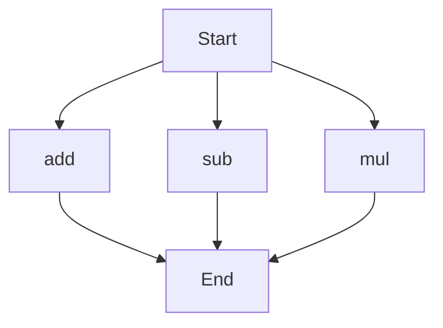

# API Documentation

## calculator.py
This module provides basic arithmetic operations.

### add(a, b)
#### Description
The `add` function calculates the sum of two numbers.
#### Parameters
* `a` (int or float): The first number to add.
* `b` (int or float): The second number to add.
#### Returns
* `int` or `float`: The sum of `a` and `b`.
#### Example
```python
result = add(5, 3)
print(result)  # Output: 8
```

### sub(c, d)
#### Description
The `sub` function calculates the difference between two numbers.
#### Parameters
* `c` (int or float): The first number.
* `d` (int or float): The second number to subtract.
#### Returns
* `int` or `float`: The difference between `c` and `d`.
#### Example
```python
result = sub(10, 4)
print(result)  # Output: 6
```

### mul(a, b)
#### Description
The `mul` function calculates the product of two numbers.
#### Parameters
* `a` (int or float): The first number to multiply.
* `b` (int or float): The second number to multiply.
#### Returns
* `int` or `float`: The product of `a` and `b`.
#### Example
```python
result = mul(7, 2)
print(result)  # Output: 14
```

Since this module contains multiple functions, the execution flow can be represented as follows:

This flowchart illustrates the possible execution paths for the functions in this module. Note that the actual execution flow may vary depending on how the functions are called.