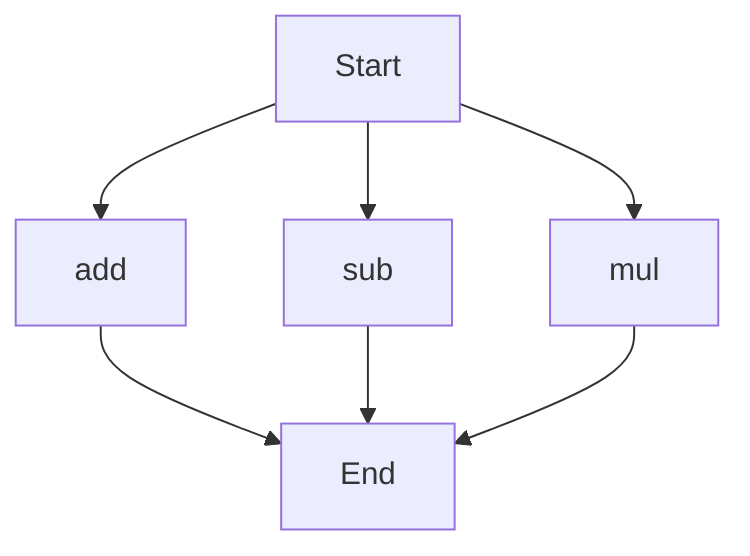

# API Documentation
## calculator.py
The calculator.py file contains a set of mathematical functions to perform basic arithmetic operations.

### add(a, b)
#### Description
This function calculates the sum of two numbers.
#### Parameters
* `a` (int or float): The first number to add.
* `b` (int or float): The second number to add.
#### Returns
The sum of `a` and `b`.
#### Example
```python
result = add(5, 7)
print(result)  # Output: 12
```

### sub(c, d)
#### Description
This function calculates the difference between two numbers.
#### Parameters
* `c` (int or float): The first number.
* `d` (int or float): The second number to subtract.
#### Returns
The difference between `c` and `d`.
#### Example
```python
result = sub(10, 4)
print(result)  # Output: 6
```

### mul(a, b)
#### Description
This function calculates the product of two numbers.
#### Parameters
* `a` (int or float): The first number to multiply.
* `b` (int or float): The second number to multiply.
#### Returns
The product of `a` and `b`.
#### Example
```python
result = mul(3, 9)
print(result)  # Output: 27
```

Since there are multiple functions in this file, here is a flowchart showing the execution flow:

This script does not contain any module-level code, classes, or variables to document.