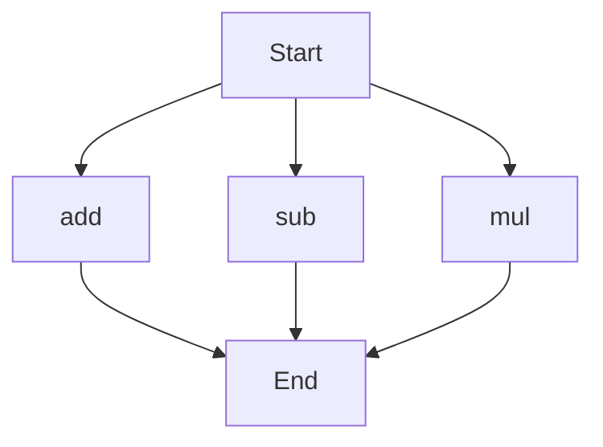

# API Documentation
## calculator.py
### add(a, b)
#### Description
The `add` function calculates the sum of two numbers.

#### Parameters
* `a` (int or float): The first number to add.
* `b` (int or float): The second number to add.

#### Returns
The sum of `a` and `b` as an integer or float.

#### Example
```python
result = add(5, 7)
print(result)  # Outputs: 12
```

### sub(c, d)
#### Description
The `sub` function calculates the difference of two numbers.

#### Parameters
* `c` (int or float): The first number.
* `d` (int or float): The second number to subtract.

#### Returns
The difference of `c` and `d` as an integer or float.

#### Example
```python
result = sub(10, 4)
print(result)  # Outputs: 6
```

### mul(a, b)
#### Description
The `mul` function calculates the product of two numbers.

#### Parameters
* `a` (int or float): The first number to multiply.
* `b` (int or float): The second number to multiply.

#### Returns
The product of `a` and `b` as an integer or float.

#### Example
```python
result = mul(5, 6)
print(result)  # Outputs: 30
```

Since `calculator.py` contains more than one function, the execution flow can be represented as:
