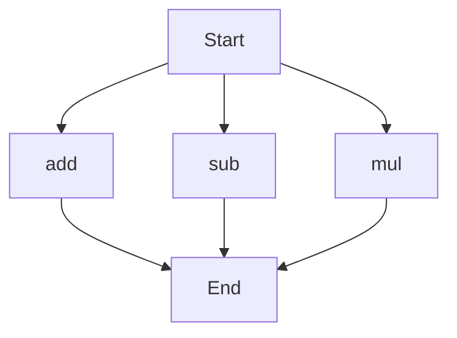

# API Documentation
## calculator.py
The calculator.py file contains a set of mathematical functions that can be used to perform basic arithmetic operations.

### Functions
#### add(a, b)
##### Description
The `add` function takes two numbers as input and returns their sum.

##### Parameters
* `a` (number): The first number to add.
* `b` (number): The second number to add.

##### Returns
* The sum of `a` and `b`.

##### Example
```python
result = add(3, 5)
print(result)  # Outputs: 8
```

#### sub(c, d)
##### Description
The `sub` function takes two numbers as input and returns their difference.

##### Parameters
* `c` (number): The first number.
* `d` (number): The second number to subtract from the first.

##### Returns
* The difference between `c` and `d`.

##### Example
```python
result = sub(10, 4)
print(result)  # Outputs: 6
```

#### mul(a, b)
##### Description
The `mul` function takes two numbers as input and returns their product.

##### Parameters
* `a` (number): The first number to multiply.
* `b` (number): The second number to multiply.

##### Returns
* The product of `a` and `b`.

##### Example
```python
result = mul(4, 5)
print(result)  # Outputs: 20
```

### Execution Flow
Since there are multiple functions in this file, the following flowchart illustrates the execution flow:

Note: The flowchart indicates that the execution flow can start with any of the three functions, and each function will execute independently.

### Module-Level Code
When run directly, this script does not have any module-level code that executes. It is designed to be imported and used as a module by other scripts.