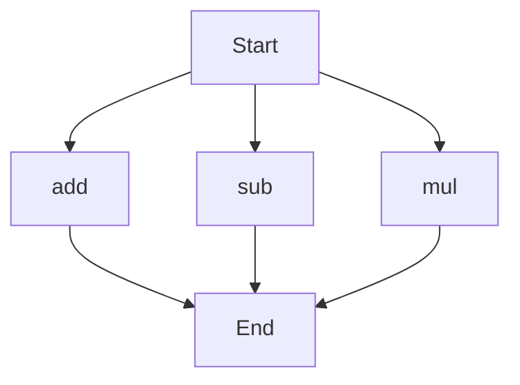

# API Documentation

## calculator.py
The calculator.py file contains a collection of mathematical functions.

### add(a, b)
#### Description
The `add` function calculates the sum of two numbers.

#### Parameters
* `a` (int or float): The first number to add.
* `b` (int or float): The second number to add.

#### Returns
The sum of `a` and `b`.

#### Example
```python
result = add(5, 3)
print(result)  # Outputs: 8
```

### sub(c, d)
#### Description
The `sub` function calculates the difference between two numbers.

#### Parameters
* `c` (int or float): The first number.
* `d` (int or float): The second number to subtract.

#### Returns
The difference between `c` and `d`.

#### Example
```python
result = sub(10, 4)
print(result)  # Outputs: 6
```

### mul(a, b)
#### Description
The `mul` function calculates the product of two numbers.

#### Parameters
* `a` (int or float): The first number to multiply.
* `b` (int or float): The second number to multiply.

#### Returns
The product of `a` and `b`.

#### Example
```python
result = mul(5, 6)
print(result)  # Outputs: 30
```

Since the calculator.py file contains more than one function, the execution flow is illustrated below:

Note: The flowchart shows the possible entry points for each function, but it does not imply a specific execution order, as the functions can be called independently.