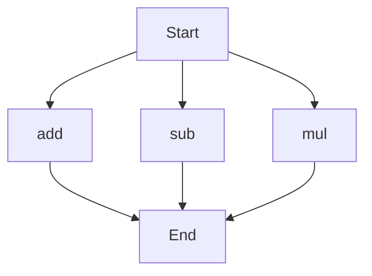

# API Documentation
## calculator.py
The calculator.py file contains a set of mathematical functions that can be used to perform basic arithmetic operations.

### Functions
#### add(a, b)
##### Description
The `add` function takes two numbers as input and returns their sum.
##### Parameters
* `a` (number): The first number to add.
* `b` (number): The second number to add.
##### Returns
* `result` (number): The sum of `a` and `b`.
##### Example
```python
result = add(5, 3)
print(result)  # Outputs: 8
```

#### sub(c, d)
##### Description
The `sub` function takes two numbers as input and returns their difference.
##### Parameters
* `c` (number): The first number.
* `d` (number): The second number to subtract from the first.
##### Returns
* `result` (number): The difference between `c` and `d`.
##### Example
```python
result = sub(10, 4)
print(result)  # Outputs: 6
```

#### mul(a, b)
##### Description
The `mul` function takes two numbers as input and returns their product.
##### Parameters
* `a` (number): The first number to multiply.
* `b` (number): The second number to multiply.
##### Returns
* `result` (number): The product of `a` and `b`.
##### Example
```python
result = mul(5, 6)
print(result)  # Outputs: 30
```

### Execution Flow
Since there are multiple functions in this file, the execution flow can be represented as follows:

Note: The execution flow chart shows that the program can start with any of the three functions, and each function will execute independently. 

There are no classes or variables defined in this module. If this script were run directly, it would not execute any code as it only contains function definitions. To use these functions, you would need to import this module in another script or call the functions directly.