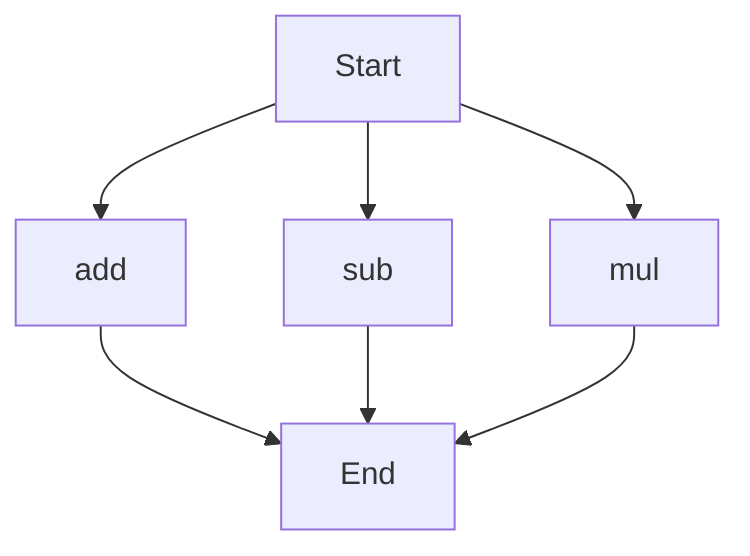

# API Documentation

## calculator.py
This file contains a set of mathematical functions that can be used to perform basic arithmetic operations.

### add(a, b)
#### Description
This function takes two numbers as input and returns their sum.

#### Parameters
* `a` (int or float): The first number to add.
* `b` (int or float): The second number to add.

#### Returns
* `int` or `float`: The sum of `a` and `b`.

#### Example
```python
result = add(5, 3)
print(result)  # Output: 8
```

### sub(c, d)
#### Description
This function takes two numbers as input and returns their difference.

#### Parameters
* `c` (int or float): The first number.
* `d` (int or float): The second number to subtract from the first.

#### Returns
* `int` or `float`: The difference between `c` and `d`.

#### Example
```python
result = sub(10, 4)
print(result)  # Output: 6
```

### mul(a, b)
#### Description
This function takes two numbers as input and returns their product.

#### Parameters
* `a` (int or float): The first number to multiply.
* `b` (int or float): The second number to multiply.

#### Returns
* `int` or `float`: The product of `a` and `b`.

#### Example
```python
result = mul(5, 6)
print(result)  # Output: 30
```

Since there are multiple functions in this file, the execution flow can be represented as follows:

This flowchart shows that the execution can start with any of the three functions (`add`, `sub`, or `mul`), and each function will return a result. 

Note: There are no classes or variables in this file, so no documentation is provided for those.