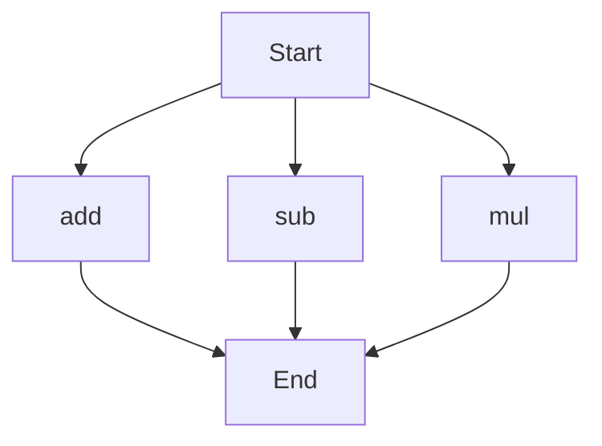

# API Documentation

## calculator.py
The calculator.py file contains a collection of mathematical functions for basic arithmetic operations. It provides methods for addition, subtraction, and multiplication.

### add(a, b)
#### Description
The `add` function takes two numbers as input and returns their sum.

#### Parameters
* `a` (int or float): The first number to be added.
* `b` (int or float): The second number to be added.

#### Returns
* `int` or `float`: The sum of `a` and `b`.

#### Example
```python
result = add(5, 7)
print(result)  # Output: 12
```

### sub(c, d)
#### Description
The `sub` function takes two numbers as input and returns their difference.

#### Parameters
* `c` (int or float): The first number.
* `d` (int or float): The second number to be subtracted from the first.

#### Returns
* `int` or `float`: The difference between `c` and `d`.

#### Example
```python
result = sub(10, 4)
print(result)  # Output: 6
```

### mul(a, b)
#### Description
The `mul` function takes two numbers as input and returns their product.

#### Parameters
* `a` (int or float): The first number to be multiplied.
* `b` (int or float): The second number to be multiplied.

#### Returns
* `int` or `float`: The product of `a` and `b`.

#### Example
```python
result = mul(6, 8)
print(result)  # Output: 48
```

Since the calculator.py file contains more than one function, the execution flow can be represented as follows:

This flowchart demonstrates how the program can start and execute any of the three functions (`add`, `sub`, `mul`) before reaching the end.

When run directly, the calculator.py script does not have a main block or any module-level code that executes print statements or other operations. It is designed to be imported and used as a module in other scripts.