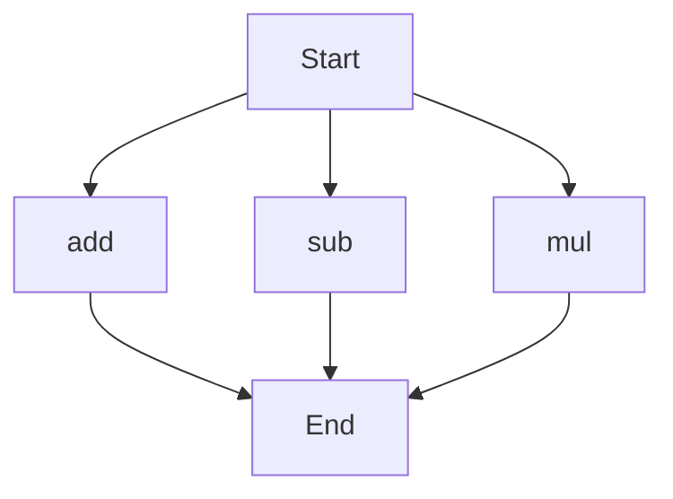

# API Documentation

## calculator.py
The calculator.py file contains a collection of mathematical functions. 

### add(a, b)
#### Description
The `add` function calculates the sum of two numbers.
#### Parameters
* `a` (int or float): The first number to be added.
* `b` (int or float): The second number to be added.
#### Returns
The sum of `a` and `b`.
#### Example
```python
result = add(5, 7)
print(result)  # Outputs: 12
```

### sub(c, d)
#### Description
The `sub` function calculates the difference between two numbers.
#### Parameters
* `c` (int or float): The first number.
* `d` (int or float): The second number to be subtracted from the first.
#### Returns
The difference between `c` and `d`.
#### Example
```python
result = sub(10, 4)
print(result)  # Outputs: 6
```

### mul(a, b)
#### Description
The `mul` function calculates the product of two numbers.
#### Parameters
* `a` (int or float): The first number to be multiplied.
* `b` (int or float): The second number to be multiplied.
#### Returns
The product of `a` and `b`.
#### Example
```python
result = mul(5, 6)
print(result)  # Outputs: 30
```

Since there are multiple functions in this file, here is a flowchart showing the execution flow:

When run directly, this script does not have any specific functionality. It is designed to be imported as a module in other scripts, providing the mathematical functions `add`, `sub`, and `mul`.