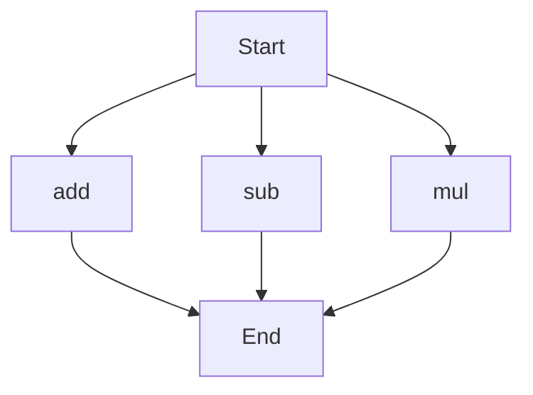

# API Documentation

## calculator.py
### Overview
The calculator.py file contains a set of mathematical functions for basic arithmetic operations. 

### Functions
#### add(a, b)
##### Description
The `add` function takes two numbers as input and returns their sum.

##### Parameters
* `a` (int or float): The first number to be added.
* `b` (int or float): The second number to be added.

##### Returns
* `int` or `float`: The sum of `a` and `b`.

##### Example
```python
result = add(2, 3)
print(result)  # Output: 5
```

#### sub(c, d)
##### Description
The `sub` function takes two numbers as input and returns their difference.

##### Parameters
* `c` (int or float): The first number.
* `d` (int or float): The second number to be subtracted from the first.

##### Returns
* `int` or `float`: The difference between `c` and `d`.

##### Example
```python
result = sub(5, 2)
print(result)  # Output: 3
```

#### mul(a, b)
##### Description
The `mul` function takes two numbers as input and returns their product.

##### Parameters
* `a` (int or float): The first number to be multiplied.
* `b` (int or float): The second number to be multiplied.

##### Returns
* `int` or `float`: The product of `a` and `b`.

##### Example
```python
result = mul(4, 5)
print(result)  # Output: 20
```

### Execution Flow


Note: Since the file does not contain any class, variable or module-level code, only function documentation is provided. The flowchart illustrates the possible execution paths for the functions in the calculator.py file.