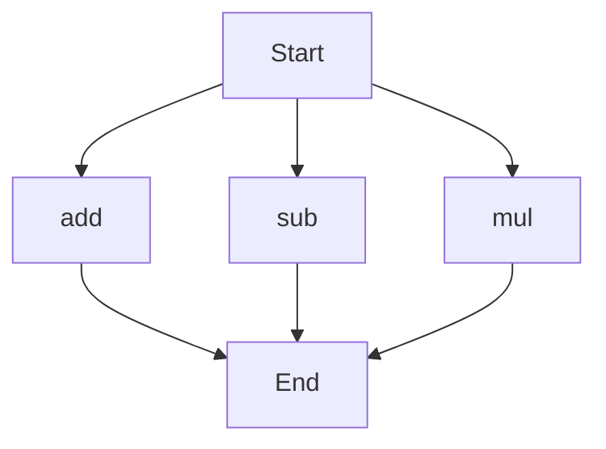

# API Documentation
## calculator.py
The `calculator.py` file contains a collection of mathematical functions that can be used to perform basic arithmetic operations.

### add(a, b)
#### Description
The `add` function takes two parameters and returns their sum.

#### Parameters
* `a` (number): The first number to add.
* `b` (number): The second number to add.

#### Returns
* `result` (number): The sum of `a` and `b`.

#### Example
```python
result = add(2, 3)
print(result)  # Output: 5
```

### sub(c, d)
#### Description
The `sub` function takes two parameters and returns their difference.

#### Parameters
* `c` (number): The first number.
* `d` (number): The second number to subtract from the first.

#### Returns
* `result` (number): The difference between `c` and `d`.

#### Example
```python
result = sub(5, 2)
print(result)  # Output: 3
```

### mul(a, b)
#### Description
The `mul` function takes two parameters and returns their product.

#### Parameters
* `a` (number): The first number to multiply.
* `b` (number): The second number to multiply.

#### Returns
* `result` (number): The product of `a` and `b`.

#### Example
```python
result = mul(4, 5)
print(result)  # Output: 20
```

Since there are multiple functions in this file, the following flowchart illustrates the execution flow:

Note that the `calculator.py` file does not contain any classes or variables. When run directly, this script does not execute any specific code, as it only defines functions for use in other parts of the application.