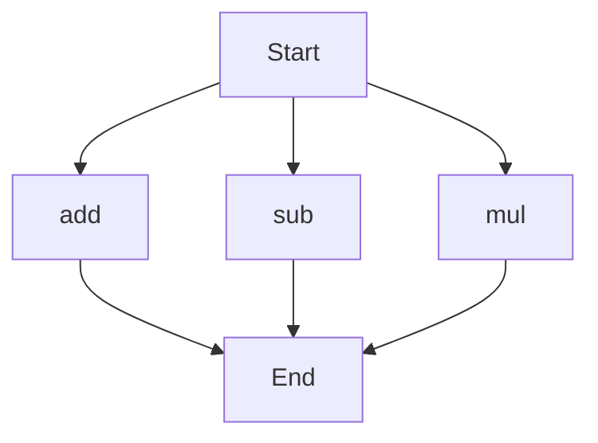

# API Documentation
## calculator.py
The calculator.py file contains a set of basic arithmetic functions.

### Functions
#### add(a, b)
##### Description
The `add` function takes two numbers as input and returns their sum.
##### Parameters
* `a` (int or float): The first number to add.
* `b` (int or float): The second number to add.
##### Returns
* `int` or `float`: The sum of `a` and `b`.
##### Example
```python
result = add(5, 3)
print(result)  # Outputs: 8
```

#### sub(c, d)
##### Description
The `sub` function takes two numbers as input and returns their difference.
##### Parameters
* `c` (int or float): The first number.
* `d` (int or float): The second number to subtract from the first.
##### Returns
* `int` or `float`: The difference between `c` and `d`.
##### Example
```python
result = sub(10, 4)
print(result)  # Outputs: 6
```

#### mul(a, b)
##### Description
The `mul` function takes two numbers as input and returns their product.
##### Parameters
* `a` (int or float): The first number to multiply.
* `b` (int or float): The second number to multiply.
##### Returns
* `int` or `float`: The product of `a` and `b`.
##### Example
```python
result = mul(5, 6)
print(result)  # Outputs: 30
```

### Execution Flow
Since there are multiple functions in this file, the execution flow can be represented as follows:

This flowchart illustrates the possible paths of execution when using the functions in the calculator.py file. Note that the actual execution flow depends on how the functions are called and used in a specific program.

### Module-Level Code
When run directly, this script does not execute any specific tasks as it only contains function definitions. To use the functions, they need to be called from another part of the program or from an interactive Python environment.