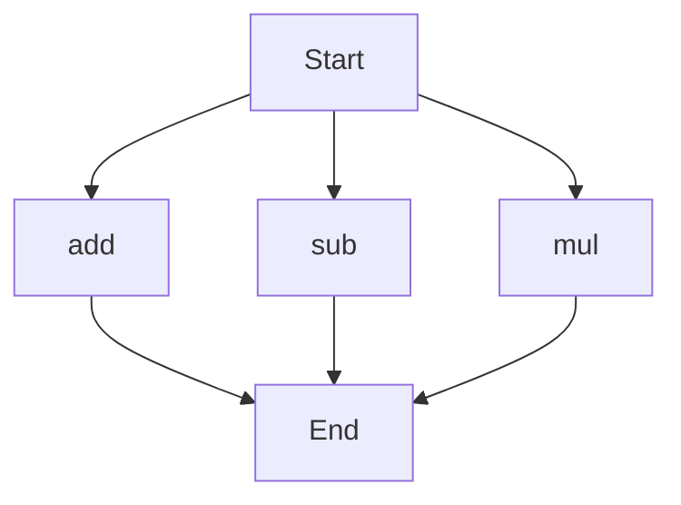

# API Documentation

## calculator.py
### Overview
This module provides a set of basic arithmetic functions.

### Functions
#### add(a, b)
##### Description
The `add` function calculates the sum of two numbers.
##### Parameters
* `a` (int or float): The first number to add.
* `b` (int or float): The second number to add.
##### Returns
The sum of `a` and `b`.
##### Example
```python
result = add(3, 5)
print(result)  # Output: 8
```

#### sub(c, d)
##### Description
The `sub` function calculates the difference between two numbers.
##### Parameters
* `c` (int or float): The first number.
* `d` (int or float): The second number to subtract from the first.
##### Returns
The difference between `c` and `d`.
##### Example
```python
result = sub(10, 4)
print(result)  # Output: 6
```

#### mul(a, b)
##### Description
The `mul` function calculates the product of two numbers.
##### Parameters
* `a` (int or float): The first number to multiply.
* `b` (int or float): The second number to multiply.
##### Returns
The product of `a` and `b`.
##### Example
```python
result = mul(4, 5)
print(result)  # Output: 20
```

### Execution Flow
Since this module contains multiple functions, the execution flow is as follows:

Note: The execution flow is not a traditional flowchart, as the functions in this module are independent and can be called separately. The flowchart above represents the possible entry points into the module.

### Module-Level Code
This module does not contain any module-level code. It is intended to be used as a library, with its functions being imported and used in other scripts.