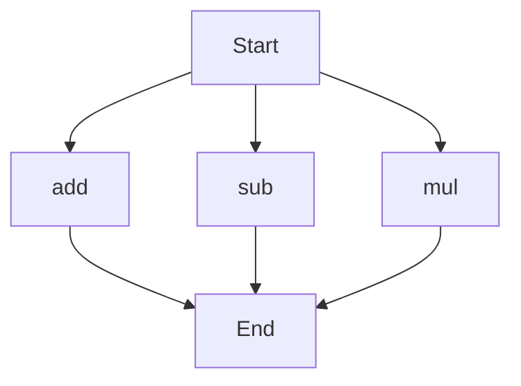

# API Documentation
## calculator.py
The calculator.py file contains a collection of mathematical functions. 

### add(a, b)
#### Description
The add function takes two parameters and returns their sum.
#### Parameters
* `a` (int or float): The first number to add.
* `b` (int or float): The second number to add.
#### Returns
* `result` (int or float): The sum of `a` and `b`.
#### Example
```python
result = add(5, 7)
print(result)  # Outputs: 12
```

### sub(c, d)
#### Description
The sub function takes two parameters and returns their difference.
#### Parameters
* `c` (int or float): The first number.
* `d` (int or float): The second number to subtract from the first.
#### Returns
* `result` (int or float): The difference between `c` and `d`.
#### Example
```python
result = sub(10, 4)
print(result)  # Outputs: 6
```

### mul(a, b)
#### Description
The mul function takes two parameters and returns their product.
#### Parameters
* `a` (int or float): The first number to multiply.
* `b` (int or float): The second number to multiply.
#### Returns
* `result` (int or float): The product of `a` and `b`.
#### Example
```python
result = mul(5, 6)
print(result)  # Outputs: 30
```

Since there are multiple functions in this file, here is a flowchart showing the execution flow:
