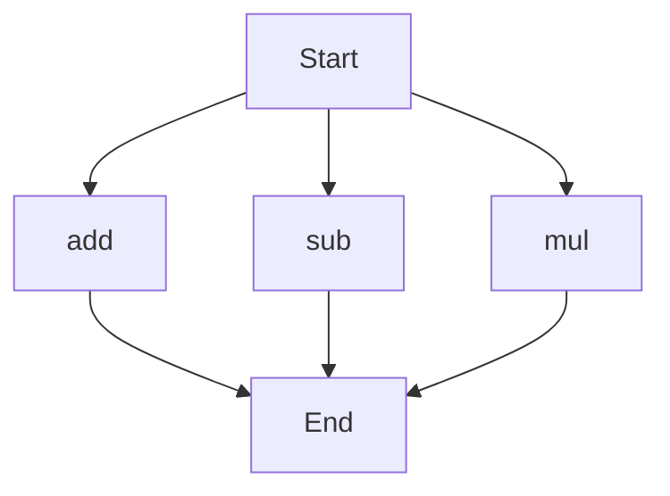

# API Documentation
## calculator.py
### Description of calculator.py
The calculator.py script provides basic arithmetic operations.

### Functions
#### add(a, b)
##### Description
This function adds two numbers together.
##### Parameters
* `a` (int or float): The first number to add.
* `b` (int or float): The second number to add.
##### Returns
* `result` (int or float): The sum of `a` and `b`.
##### Example
```python
result = add(5, 7)
print(result)  # Outputs: 12
```

#### sub(c, d)
##### Description
This function subtracts one number from another.
##### Parameters
* `c` (int or float): The number to subtract from.
* `d` (int or float): The number to subtract.
##### Returns
* `result` (int or float): The difference of `c` and `d`.
##### Example
```python
result = sub(10, 4)
print(result)  # Outputs: 6
```

#### mul(a, b)
##### Description
This function multiplies two numbers together.
##### Parameters
* `a` (int or float): The first number to multiply.
* `b` (int or float): The second number to multiply.
##### Returns
* `result` (int or float): The product of `a` and `b`.
##### Example
```python
result = mul(6, 9)
print(result)  # Outputs: 54
```

### Execution Flow


No classes or variables are defined in this script. When run directly, the script does not execute any specific block of code as it only contains function definitions.