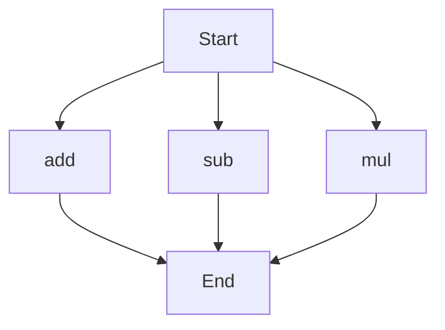

# API Documentation
## calculator.py
The calculator.py file contains a collection of mathematical functions.

### Functions
#### add(a, b)
##### Description
The `add` function calculates the sum of two numbers.
##### Parameters
* `a` (int or float): The first number to add.
* `b` (int or float): The second number to add.
##### Returns
* `int` or `float`: The sum of `a` and `b`.
##### Example
```python
result = add(5, 7)
print(result)  # Output: 12
```

#### sub(c, d)
##### Description
The `sub` function calculates the difference of two numbers.
##### Parameters
* `c` (int or float): The first number.
* `d` (int or float): The second number to subtract from the first.
##### Returns
* `int` or `float`: The difference of `c` and `d`.
##### Example
```python
result = sub(10, 4)
print(result)  # Output: 6
```

#### mul(a, b)
##### Description
The `mul` function calculates the product of two numbers.
##### Parameters
* `a` (int or float): The first number to multiply.
* `b` (int or float): The second number to multiply.
##### Returns
* `int` or `float`: The product of `a` and `b`.
##### Example
```python
result = mul(6, 9)
print(result)  # Output: 54
```

Since there are multiple functions in this file, here is a flowchart showing the execution flow:


Note: This flowchart shows that the execution can start with any of the functions (`add`, `sub`, `mul`) and will end after the function is executed. 

No classes or variables are defined in this file. 

When run directly, this script does not have any specific behavior, as it only contains function definitions.