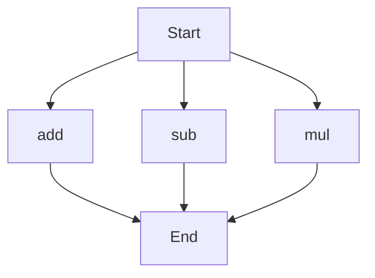

# API Documentation
## calculator.py
The calculator.py file contains a collection of basic arithmetic functions.

### add(a, b)
#### Description
The `add` function calculates the sum of two numbers.

#### Parameters
* `a` (int or float): The first number to be added.
* `b` (int or float): The second number to be added.

#### Returns
* The sum of `a` and `b` (int or float).

#### Example
```python
result = add(5, 3)
print(result)  # Outputs: 8
```

### sub(c, d)
#### Description
The `sub` function calculates the difference between two numbers.

#### Parameters
* `c` (int or float): The first number.
* `d` (int or float): The second number to be subtracted from the first.

#### Returns
* The difference between `c` and `d` (int or float).

#### Example
```python
result = sub(10, 4)
print(result)  # Outputs: 6
```

### mul(a, b)
#### Description
The `mul` function calculates the product of two numbers.

#### Parameters
* `a` (int or float): The first number to be multiplied.
* `b` (int or float): The second number to be multiplied.

#### Returns
* The product of `a` and `b` (int or float).

#### Example
```python
result = mul(5, 6)
print(result)  # Outputs: 30
```

Since the calculator.py file has more than one function, the following flowchart illustrates the execution flow:

When run directly, the script does not have any specific functionality, as it only defines these arithmetic functions. To utilize these functions, they must be called from within the script or another script that imports this module.