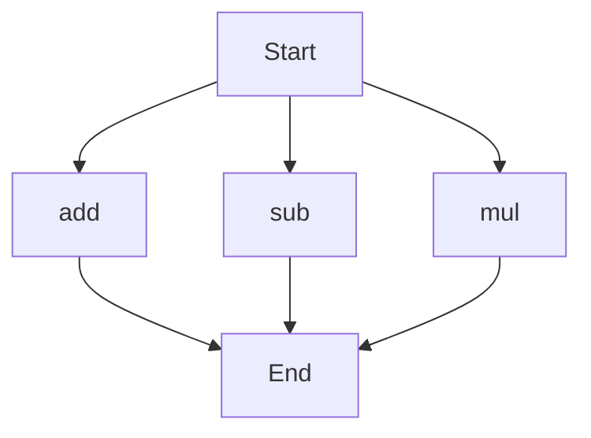

# API Documentation

## calculator.py
This module provides basic arithmetic operations.

### Functions
#### add(a, b)
##### Description
The `add` function calculates the sum of two numbers.

##### Parameters
* `a` (int or float): The first number to add.
* `b` (int or float): The second number to add.

##### Returns
* `int` or `float`: The sum of `a` and `b`.

##### Example
```python
result = add(5, 7)
print(result)  # Outputs: 12
```

#### sub(c, d)
##### Description
The `sub` function calculates the difference between two numbers.

##### Parameters
* `c` (int or float): The first number.
* `d` (int or float): The second number to subtract from the first.

##### Returns
* `int` or `float`: The difference between `c` and `d`.

##### Example
```python
result = sub(10, 4)
print(result)  # Outputs: 6
```

#### mul(a, b)
##### Description
The `mul` function calculates the product of two numbers.

##### Parameters
* `a` (int or float): The first number to multiply.
* `b` (int or float): The second number to multiply.

##### Returns
* `int` or `float`: The product of `a` and `b`.

##### Example
```python
result = mul(5, 6)
print(result)  # Outputs: 30
```

### Execution Flow
Since there are multiple functions in this module, the execution flow is as follows:

Note that the execution flow is not strictly sequential, as the functions can be called independently. This flowchart illustrates the possible paths of execution when using these functions. 

When run directly, this script does not have a main block, so it does not perform any actions on its own. It is intended to be imported and used as a module in other scripts.