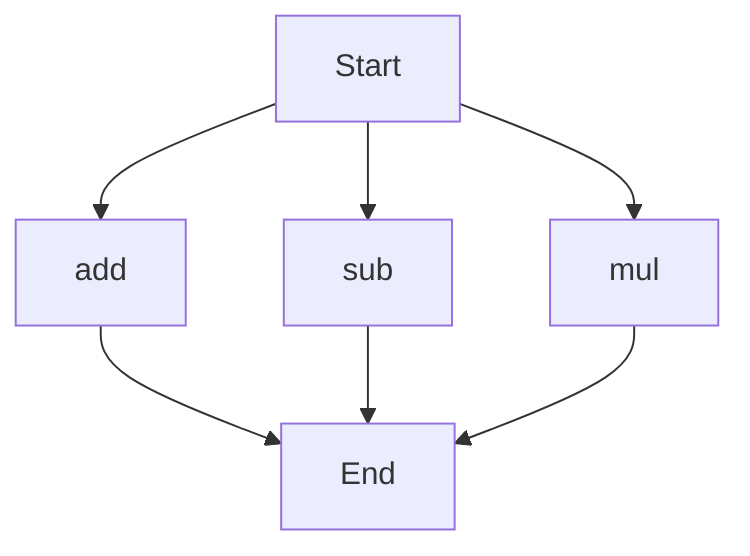

# API Documentation
## calculator.py
The calculator.py file contains a collection of mathematical functions that can be used to perform basic arithmetic operations.

### add(a, b)
#### Description
The `add` function calculates the sum of two numbers.

#### Parameters
* `a` (int or float): The first number to be added.
* `b` (int or float): The second number to be added.

#### Returns
* `int` or `float`: The sum of `a` and `b`.

#### Example
```python
result = add(5, 3)
print(result)  # Outputs: 8
```

### sub(c, d)
#### Description
The `sub` function calculates the difference between two numbers.

#### Parameters
* `c` (int or float): The first number.
* `d` (int or float): The second number to be subtracted from `c`.

#### Returns
* `int` or `float`: The difference between `c` and `d`.

#### Example
```python
result = sub(10, 4)
print(result)  # Outputs: 6
```

### mul(a, b)
#### Description
The `mul` function calculates the product of two numbers.

#### Parameters
* `a` (int or float): The first number to be multiplied.
* `b` (int or float): The second number to be multiplied.

#### Returns
* `int` or `float`: The product of `a` and `b`.

#### Example
```python
result = mul(5, 6)
print(result)  # Outputs: 30
```

Since the calculator.py file contains more than one function, the following flowchart illustrates the execution flow:

When run directly, the calculator.py script does not contain any module-level code, so it does not perform any actions without being imported as a module.