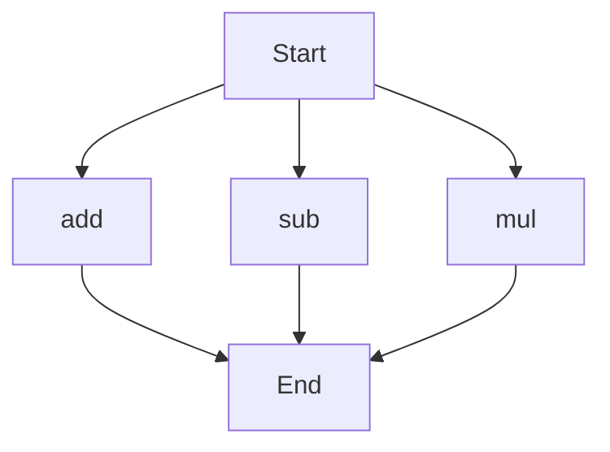

# API Documentation
## calculator.py
### Functions
#### add(a, b)
##### Description
The `add` function calculates the sum of two numbers.
##### Parameters
* `a` (int or float): The first number to add.
* `b` (int or float): The second number to add.
##### Returns
The sum of `a` and `b`.
##### Example
```python
result = add(5, 7)
print(result)  # Outputs: 12
```

#### sub(c, d)
##### Description
The `sub` function calculates the difference of two numbers.
##### Parameters
* `c` (int or float): The first number.
* `d` (int or float): The second number to subtract.
##### Returns
The difference of `c` and `d`.
##### Example
```python
result = sub(10, 4)
print(result)  # Outputs: 6
```

#### mul(a, b)
##### Description
The `mul` function calculates the product of two numbers.
##### Parameters
* `a` (int or float): The first number to multiply.
* `b` (int or float): The second number to multiply.
##### Returns
The product of `a` and `b`.
##### Example
```python
result = mul(5, 6)
print(result)  # Outputs: 30
```

### Execution Flow

Note: The execution flow shows the possible paths of execution when the `calculator.py` file is run directly. However, without the actual code, it's assumed that each function can be called independently. 

There are no classes or variables in this file, so those sections are omitted. If there were module-level code, it would be described here, but since the provided information only includes function definitions, that section is also omitted.