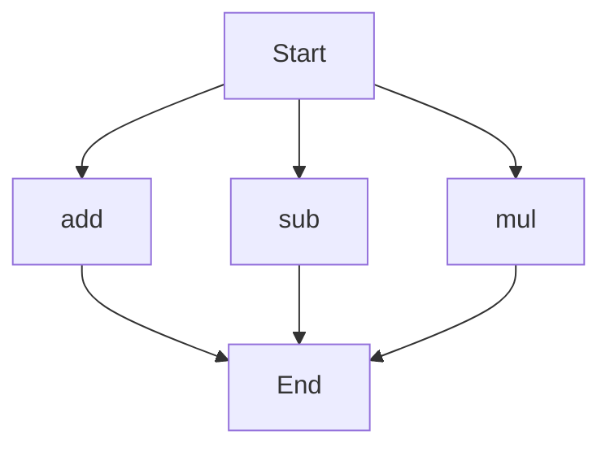

# API Documentation

## calculator.py
### Overview
The calculator.py file contains a collection of mathematical functions to perform basic arithmetic operations.

### Functions
#### add(a, b)
##### Description
The `add` function calculates the sum of two numbers.
##### Parameters
* `a` (int or float): The first number to add.
* `b` (int or float): The second number to add.
##### Returns
The sum of `a` and `b`.
##### Example
```python
result = add(5, 7)
print(result)  # Output: 12
```

#### sub(c, d)
##### Description
The `sub` function calculates the difference between two numbers.
##### Parameters
* `c` (int or float): The first number.
* `d` (int or float): The second number to subtract from the first.
##### Returns
The difference between `c` and `d`.
##### Example
```python
result = sub(10, 4)
print(result)  # Output: 6
```

#### mul(a, b)
##### Description
The `mul` function calculates the product of two numbers.
##### Parameters
* `a` (int or float): The first number to multiply.
* `b` (int or float): The second number to multiply.
##### Returns
The product of `a` and `b`.
##### Example
```python
result = mul(6, 9)
print(result)  # Output: 54
```

### Execution Flow

```mermaid
flowchart TD
    A[Start] --> B[add]
    A --> C[sub]
    A --> D[mul]
    B --> E[End]
    C --> E
    D --> E
```
Note: The execution flow is a simple representation and does not imply any specific order or dependency between the functions. In a real-world scenario, the functions would be called separately as needed. 

There are no classes or variables defined in this file. When run directly, this script does not perform any specific actions, as it only contains function definitions.