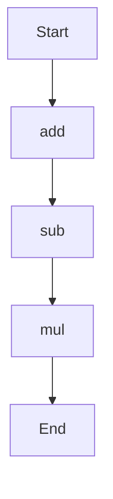

# API Documentation
## calculator.py
The `calculator.py` file provides basic arithmetic operations. When run directly, this script does not execute any specific code as it only defines functions.

### Functions
#### add(a, b)
##### Description
The `add` function takes two numbers as input and returns their sum.

##### Parameters
* `a` (int or float): The first number to add.
* `b` (int or float): The second number to add.

##### Returns
* `int` or `float`: The sum of `a` and `b`.

##### Example
```python
result = add(5, 7)
print(result)  # Outputs: 12
```

#### sub(c, d)
##### Description
The `sub` function takes two numbers as input and returns their difference.

##### Parameters
* `c` (int or float): The first number.
* `d` (int or float): The second number to subtract from the first.

##### Returns
* `int` or `float`: The difference between `c` and `d`.

##### Example
```python
result = sub(10, 4)
print(result)  # Outputs: 6
```

#### mul(a, b)
##### Description
The `mul` function takes two numbers as input and returns their product.

##### Parameters
* `a` (int or float): The first number to multiply.
* `b` (int or float): The second number to multiply.

##### Returns
* `int` or `float`: The product of `a` and `b`.

##### Example
```python
result = mul(5, 6)
print(result)  # Outputs: 30
```

### Execution Flow
Since `calculator.py` contains more than one function, the following flowchart illustrates a possible execution flow when using these functions in a specific order:

```mermaid
flowchart TD
    A[Start] --> B[add]
    B --> C[sub]
    C --> D[mul]
    D --> E[End]
```
This flowchart demonstrates one possible sequence of operations: adding two numbers, then subtracting another number from the result, and finally multiplying the outcome by another number. The actual execution flow depends on how these functions are used in the calling code.