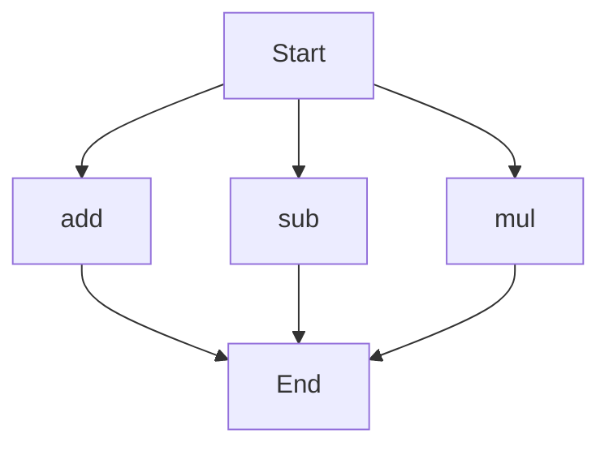

# API Documentation

## calculator.py
This module provides basic arithmetic operations.

### add(a, b)
#### Description
The `add` function calculates the sum of two numbers.

#### Parameters
* `a` (int or float): The first number to add.
* `b` (int or float): The second number to add.

#### Returns
The sum of `a` and `b`.

#### Example
```python
result = add(5, 7)
print(result)  # Output: 12
```

### sub(c, d)
#### Description
The `sub` function calculates the difference of two numbers.

#### Parameters
* `c` (int or float): The first number.
* `d` (int or float): The second number to subtract.

#### Returns
The difference of `c` and `d`.

#### Example
```python
result = sub(10, 4)
print(result)  # Output: 6
```

### mul(a, b)
#### Description
The `mul` function calculates the product of two numbers.

#### Parameters
* `a` (int or float): The first number to multiply.
* `b` (int or float): The second number to multiply.

#### Returns
The product of `a` and `b`.

#### Example
```python
result = mul(3, 9)
print(result)  # Output: 27
```

Since there are multiple functions in this module, here is a Mermaid flowchart showing the execution flow:

```mermaid
   flowchart TD
       A[Start] --> B[add]
       A --> C[sub]
       A --> D[mul]
       B --> E[End]
       C --> E
       D --> E
```
Note: This flowchart is a simple representation and does not cover all possible execution paths. The actual execution flow may vary depending on the specific use case. 

When run directly, this script does not have a main block, so there is no specific functionality executed. It provides a set of functions for arithmetic operations that can be used in other scripts or applications.