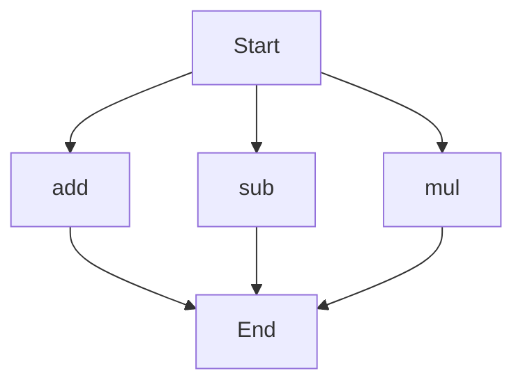

# API Documentation

## calculator.py
The calculator.py file contains a set of mathematical functions that can be used to perform basic arithmetic operations.

### add(a, b)
#### Description
The `add` function takes two numbers as input and returns their sum.

#### Parameters
* `a` (number): The first number to add.
* `b` (number): The second number to add.

#### Returns
* The sum of `a` and `b` (number).

#### Example
```python
result = add(5, 3)
print(result)  # Outputs: 8
```

### sub(c, d)
#### Description
The `sub` function takes two numbers as input and returns their difference.

#### Parameters
* `c` (number): The first number.
* `d` (number): The second number to subtract from the first.

#### Returns
* The difference between `c` and `d` (number).

#### Example
```python
result = sub(10, 4)
print(result)  # Outputs: 6
```

### mul(a, b)
#### Description
The `mul` function takes two numbers as input and returns their product.

#### Parameters
* `a` (number): The first number to multiply.
* `b` (number): The second number to multiply.

#### Returns
* The product of `a` and `b` (number).

#### Example
```python
result = mul(7, 2)
print(result)  # Outputs: 14
```

Since there are multiple functions in the calculator.py file, the execution flow can be represented as follows:

```mermaid
flowchart TD
    A[Start] --> B[add]
    A --> C[sub]
    A --> D[mul]
    B --> E[End]
    C --> E
    D --> E
```
When run directly, the script does not have any specific functionality as it only defines functions without any main block or module-level code.