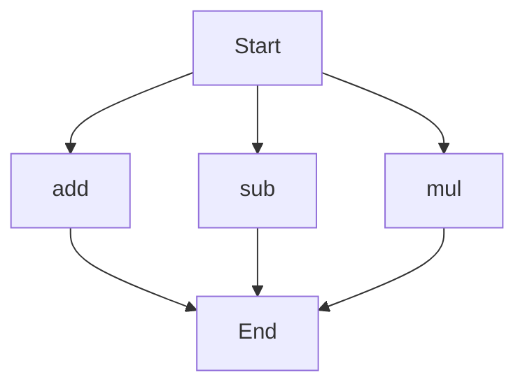

# API Documentation
## calculator.py
The calculator.py file contains a collection of mathematical functions that can be used to perform basic arithmetic operations.

### add(a, b)
#### Description
The `add` function calculates the sum of two numbers.

#### Parameters
* `a` (int or float): The first number to add.
* `b` (int or float): The second number to add.

#### Returns
* `int` or `float`: The sum of `a` and `b`.

#### Example
```python
result = add(5, 3)
print(result)  # Outputs: 8
```

### sub(c, d)
#### Description
The `sub` function calculates the difference of two numbers.

#### Parameters
* `c` (int or float): The first number.
* `d` (int or float): The second number to subtract.

#### Returns
* `int` or `float`: The difference of `c` and `d`.

#### Example
```python
result = sub(10, 4)
print(result)  # Outputs: 6
```

### mul(a, b)
#### Description
The `mul` function calculates the product of two numbers.

#### Parameters
* `a` (int or float): The first number to multiply.
* `b` (int or float): The second number to multiply.

#### Returns
* `int` or `float`: The product of `a` and `b`.

#### Example
```python
result = mul(5, 6)
print(result)  # Outputs: 30
```

Since the calculator.py file has more than one function, the following Mermaid flowchart illustrates the execution flow:

```mermaid
flowchart TD
    A[Start] --> B[add]
    A --> C[sub]
    A --> D[mul]
    B --> E[End]
    C --> E
    D --> E
```
Note: The flowchart represents the possible execution paths when using the functions in the calculator.py file. It shows that the program can start and then execute any of the `add`, `sub`, or `mul` functions before reaching the end. 

There are no classes or variables in this file, and there is no module-level code that executes when run directly.