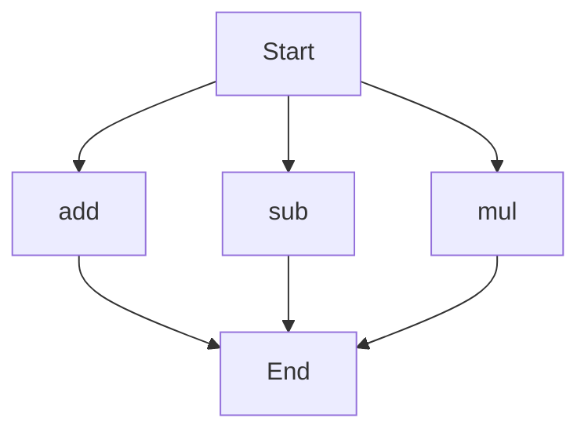

# API Documentation

## calculator.py
The calculator.py file contains a set of functions for performing basic arithmetic operations.

### add(a, b)
#### Description
The `add` function takes two numbers as input and returns their sum.

#### Parameters
* `a` (int or float): The first number to add.
* `b` (int or float): The second number to add.

#### Returns
* `int` or `float`: The sum of `a` and `b`.

#### Example
```python
result = add(5, 3)
print(result)  # Output: 8
```

### sub(c, d)
#### Description
The `sub` function takes two numbers as input and returns their difference.

#### Parameters
* `c` (int or float): The first number.
* `d` (int or float): The second number to subtract.

#### Returns
* `int` or `float`: The difference between `c` and `d`.

#### Example
```python
result = sub(10, 4)
print(result)  # Output: 6
```

### mul(a, b)
#### Description
The `mul` function takes two numbers as input and returns their product.

#### Parameters
* `a` (int or float): The first number to multiply.
* `b` (int or float): The second number to multiply.

#### Returns
* `int` or `float`: The product of `a` and `b`.

#### Example
```python
result = mul(5, 6)
print(result)  # Output: 30
```

Since the calculator.py file has multiple functions, here is a flowchart showing the execution flow:

```mermaid
flowchart TD
    A[Start] --> B[add]
    A --> C[sub]
    A --> D[mul]
    B --> E[End]
    C --> E
    D --> E
```
Note that the flowchart shows the possible execution paths for each function, but does not imply a specific order of execution. The actual execution flow will depend on how the functions are called in the code. 

When run directly, the calculator.py script does not have a main block or any module-level code that performs a specific task. It is intended to be used as a module, with its functions imported and used in other scripts.