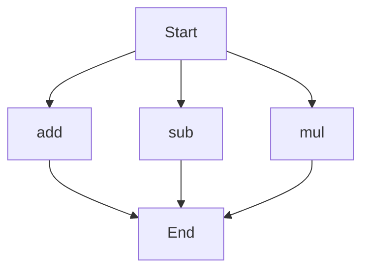

# API Documentation
## calculator.py
The calculator.py file contains a set of functions for basic mathematical operations. 

### add(a, b)
#### Description
This function adds two numbers together.

#### Parameters
* `a` (int or float): The first number to add.
* `b` (int or float): The second number to add.

#### Returns
* `int` or `float`: The sum of `a` and `b`.

#### Example
```python
result = add(5, 7)
print(result)  # Output: 12
```

### sub(c, d)
#### Description
This function subtracts one number from another.

#### Parameters
* `c` (int or float): The number to subtract from.
* `d` (int or float): The number to subtract.

#### Returns
* `int` or `float`: The difference between `c` and `d`.

#### Example
```python
result = sub(10, 4)
print(result)  # Output: 6
```

### mul(a, b)
#### Description
This function multiplies two numbers together.

#### Parameters
* `a` (int or float): The first number to multiply.
* `b` (int or float): The second number to multiply.

#### Returns
* `int` or `float`: The product of `a` and `b`.

#### Example
```python
result = mul(6, 9)
print(result)  # Output: 54
```

Since this file contains more than one function, the following Mermaid flowchart illustrates the execution flow:

```mermaid
flowchart TD
    A[Start] --> B[add]
    A --> C[sub]
    A --> D[mul]
    B --> E[End]
    C --> E
    D --> E
```
Note: The flowchart shows the potential execution paths for each function, assuming they can be called independently. In a real-world scenario, the actual flow would depend on how these functions are used within the program. 

There is no module-level code (like print statements or main blocks) in this file. The functions are designed to be imported and used in other parts of the program.